# Snow Depot

## Project Description
**Snow Depot** is an e-commerce web application for buying premium ski equipment, apparel, and accessories. Built with Django, the site aims to deliver a fast, intuitive, and secure shopping experience across devices. Customers can browse a curated catalog with rich filtering and sorting by category, subcategory, name, rating, and price. Product detail pages display comprehensive information and support size selection where appropriate, while a session-based basket enables quick additions, adjustments, and removals with real-time feedback via clear and easily visible notifications.

Checkout is powered by Stripe, using PaymentIntents for secure card processing, and includes order validation, line item creation, delivery calculation, as well as customised confirmation emails. Authenticated users can manage a profile with saved defaults for contact and address details to speed up future purchases, and view their order history. The reviews feature lets users submit and edit product reviews, enhancing trust and discoverability.

Administrative users can add, edit, and delete products through protected views. The project supports media and static file hosting on Amazon S3 in production, and is deployed as a Heroku application. SEO considerations include a robots.txt and dynamic sitemap.xml to help search engines index key pages. The front end uses Bootstrap ubiquitously for responsive layouts and consistent UI, with reusable templates and context processors to keep the experience cohesive and maintainable.

## Link to application
The application can be accessed directly at this dedicated link: https://snow-depot-2e7989adac13.herokuapp.com/

## GitHub Repository
The GitHub repository for the project can be accessed at: https://github.com/DTT2411/snow-depot

## Project Methodology
The project followed an Agile methodology throughout development, with all progress tracked transparently in GitHub Projects. User Stories formed the backbone of the process, ensuring features were developed in line with user needs and project goals.

Stories were prioritised into “must-have,” “should-have,” and “could-have” categories to define the minimum viable product and guide development focus. Work was managed using a Kanban-style workflow, where stories moved across “To-Do,” “In Progress,” and “Done” columns to clearly show progress and bottlenecks.

Each story included well-defined acceptance criteria, providing measurable conditions for success. Stories were only marked as complete when all acceptance criteria had been satisfied, ensuring quality and consistency across the project deliverables.

This structured yet flexible approach supported iterative development, continuous feedback, and the delivery of a reliable product aligned with stakeholder requirements.

## User Stories

### Authentication and Profile
|Name|Description|Priority|Status|
|---|---|---|---|
|Register Account|As a customer I can register for an account so that I don’t need to fill my details in every time I make a purchase|Must Have| Complete| 
|Log in to account|As a customer I can easily log in to my account so that I can start browsing without delay.|Must Have| Complete| 
|Log out of account|As a customer I can easily log out of my account so that I can avoid staying signed in unnecessarily.|Must Have| Complete| 
|Add contact and shipping details|As a customer I can add my default contact and shipping details to my profile so that I can have a quicker checkout process.|Must Have| Complete|
|Track previous orders|As a customer I can see a list of my previous orders so that I can keep track of what I've purchased and retain details of past orders in case there have been any issues.|Should Have|Complete| 
|Account validation|As an administrator I can ensure customers need to sign up with a valid email to login so that accounts are secured at activation and we prevent spam in the reviews.|Could Have| Complete| 

### Navigation and viewing products
|Name|Description|Priority|Status|
|---|---|---|---|
|Navigate easily|As a customer I can use a navigation bar to easily navigate around the site so that I don't struggle to find what I'm looking for quickly.|Must Have| Complete| 
|View list of all products|As a customer I can view a list of all products so that I can browse through the entire collection.|Must Have| Complete| 
|Search through categories|As a customer I can select a category of products to look through so that I can narrow down my search.|Must Have|Complete|
|Filter products|As a customer I can filter products by subcategory so that I can find a well-rated product which fits my needs and price-range.|Must Have|Complete|
|View detailed product information|As a customer I can see comprehensive product information for each individual item so that I can be fully informed about the product before buying.|Must Have|Complete| 
|Relevant product images|As a customer I can see relevant images of each product so that I can quickly assess if I like the appearance/construction and would want to buy it.|Must Have|Partially Complete*|
|Order listed products|As a customer I can order the products when viewing them in a list on screen so that I can sort by my preferences.|Should Have| Complete| 
|View site information|As a customer I can see basic information about the site so that I can determine upon first visiting whether it’s right for my needs.|Should Have| Complete| 
|Search products|As a customer I can search through products using keywords so that I can easily find a suitable product even if I'm not sure what subcategory to look in.|Should Have| Complete|
|Links to partners|As an administrator I can direct customers to a partners section on the homepage so that we can encourage customer engagement with partners as part of our mutual relationship.|Should Have|Complete| 

### Adding and purchasing products
|Name|Description|Priority|Status|
|---|---|---|---|
|Prevent invalid transactions|As an administrator I can prevent invalid or unfinished transactions from going through so that we avoid any issues with transactions being made without the order being correctly logged in the database.|Must Have|Complete| 
|Register Account|As a customer I can register for an account so that I don’t need to fill my details in every time I make a purchase|Must Have| Complete| 
|View basket|As a customer I can see a basket containing all of the items and relevant info about each in my order before checkout so I can see details of what I am purchasing at a glance.|Must Have|Complete| 
|Add to basket|As a customer I can easily add an item to my basket so that I can include it in my order.|Must Have|Complete| 
|Remove from basket|As a customer I can easily remove an item from my basket so that I can prevent it being ordered if I've changed my mind about buying.|Must Have|Complete| 
|Secure purchase|As a customer I can securely complete the purchase of products so that I can receive my order.|Must Have|Complete| 
|Update items in basket|As a customer I can change the quantity of individual items in my order so that I can correct any mistake made when adding to basket.|Should Have|Complete| 
|View running total|As a customer I can see a running total for the order in my basket so that I can track my potential spending.|Should Have|Complete|
|Check before remove item|As an customer I can receive a check before deleting an item from my order so that I avoid accidental deletions.|Could Have|Not Complete*|

### Product reviews
|Name|Description|Priority|Status|
|---|---|---|---|
|View reviews|As a customer I can see reviews for products so that I can get feedback from other purchasers about the product before buying.|Must Have|Complete|
|Submit review|As a customer I can add a review for a product I have purchased so that I can provide a rating and feedback to other potential buyers.|Must Have|Complete|
|Delete review|As an administrator I can easily delete a product review so that I can remove any spam reviews or reviews with inappropriate text.|Must Have|Complete|
|Edit review|As a customer I can edit my existing product review so that I can amend any mistakes, or update the review if circumstances have changed.|Should Have|Complete|
|Anonymous reviews|As a customer I can add a review anonymously so that I don't have to link my review with my user account, especially if I have something negative to say.|Could Have|Complete|
|List number of reviews on products|As an administrator I can show the number of reviews a product has on the product lists so that users can be encouraged to buy items which have been thoroughly vetted.|Could Have|Complete|

### Product administration
|Name|Description|Priority|Status|
|---|---|---|---|
|Add new products|As an administrator I can keep add new products to our inventory so that I can keep the store up to date with new items.|Must Have|Complete| 
|Remove products|As an administrator I can remove products from the store so that we keep the inventory up to date and prevent customers from purchasing any items which are no longer being sold.|Must Have|Complete| 
|Update products|As an administrator I can update product information so that the information on all stock is kept up to date and we can correct any issues.|Should Have|Complete| 
|Check before product deletion|As an administrator I can receive a check before deleting a product so that I avoid accidental deletions.|Could Have|Not Complete*| 
|Bulk product upload|As an administrator I can keep upload product images in bulk and complete details/descriptions for each so that I can conveniently add multiple products quickly.|Could Have|Not Complete*| 

### Messages and alerts
|Name|Description|Priority|Status|
|---|---|---|---|
|Alert user about failed payments|As a customer I can be alerted when a purchase has failed so that I can attempt to re-order, or use different payment details.|Must Have| Complete| 
|Alert user about account interactions|As a customer I can be alerted when I have logged in or out, or updated my details, so that I can be sure of my login status and details at all times.|Must Have| Complete| 
|Alert user to basket changes|As a customer I can be alerted when I have added, update or removed an item my basket so that I have a visual cue that my items are being added correct, besides the running total updating.|Should Have|Complete| 
|Email confirmation of purchase|As a customer I can receive a customised confirmation email after completing my order so that I have email evidence of the purchase and details confirmed to me.|Should Have|Complete| 

*Not complete or partially complete user stories will be discussed in the Future Improvements section

## Design

### Design Methodology
The site follows a clean, mobile-first design methodology that prioritizes clarity, speed, and conversion. A cool gray palette (light grays, charcoal, white) and generous whitespace create a crisp aesthetic, while high-contrast CTA buttons guide attention. Typography pairs a bold display face for headings with a highly legible sans-serif for body text. 

The site layout is built on a fluid, responsive grid with a consistent spacing scale, enabling card-based product tiles and balanced content sections. The structure is anchored by a sticky header with search, faceted filtering on product lists, and breadcrumb trails for navigating through different categories of products. Reusable components include navigation, product cards, forms, toast messages, and modals, all of which ensure visual consistency and predictable interaction with the various elements. 

Imagery uses full-bleed hero banners, standardized product ratios, and subtle overlays. Accessibility is integral and considerations were taken to ensure sufficient color contrast, focus states, and keyboard support. The site's performance is reinforced through responsive images, lazy-loading, and SVG icons, ensuring a fast, polished experience across devices. 

### Wireframes
Balsamiq wireframes were developed at the outset of the project as a visual guide to the structure and key features of the website. 

### Colour Scheme
Coolors was used to identify suitably contrasting colours for use across the site. A contrast checker was also utilised to ensure sufficient contrast between the primary colour and secondary & tertiary colours.
- **Primary colour - #1C3738, Gunmetal**: Used as the main background colour for large html elements. Also used for fonts on some elements with inverse colouring.
- **Secondary colour - #8BAAAD, Cadet Grey**: Mainly used on black/dark buttons and elements upon hover/docus to distinguish interaction.
- **Tertiary colour - #E3E3E3, Platinum**: Mainly used on white/light buttons and elements upon hover/focus to distinguish interaction.
- **Highlight colour - #F4FFF8, Mint Cream**: Used for contrasting text appearing imposed on the product lists i.e. with a dark background.

 

### Fonts
Google Fonts was used to identify suitable primary and secondary fonts for use throughout the site. The selected fonts were highly complementary, with the main difference being the font spacing, and otherwise similar styling.

**Headings font - Lexend Mega**: Lexend Mega is a bold, wide display sans, used for hero headings, key CTAs, and prominent navigation. 
 

**Main font - DM Sans**: DM Sans is a clean, legible sans-serif for body copy, forms, product details, and everyday UI elements. 
 

## Features

The main features of the application include:
1. Navigation Bar
2. Account Management pages
3. Profile 
4. Homepage
5. Product lists
6. Product detail pages
7. Reviews
8. Basket
9. Checkout
10. Checkout success
11. Product administration (admin-only)
12. Notifications system
13. Customised Emails
14. Other features

### 1. Navigation Bar
The navigation bar maintains a consistent, responsive header across all pages of the site. 

The left-aligned Snow Depot logo returns to the homepage. Primary product categories appear as top-level links with dropdown access to key subcategories, offering quick routes to shop pages. A prominent global search enables instant keyword queries from any page. 

On the right, user controls in the My Account section adapt to authentication state: an account/login menu (profile, orders, sign in/out) and a basket shortcut displaying the running total. 

The header is sticky so search and cart remain available while scrolling, and it collapses into a hamburger menu on smaller screens for thumb-friendly navigation. Clear icons and accessible labels support usability. The structure prioritizes product discovery, speed to checkout, and clarity.

**Navigation bar**  
 

**Navigation bar collapsed (for mobile & tablet)**  
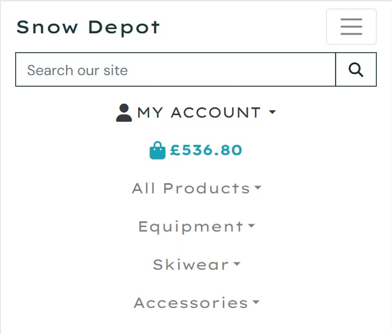 

The dropdown elements for categories and accounts work similarly on large screens and mobile. In the collapsed navigation bar, the drop-down categories open into second-level menus within the list.

**Category > Subcategory drop-down**  
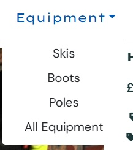 

**Account drop-down bar**  
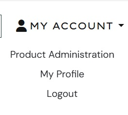 

### 2. Account Management pages
The account area is integrated with Django Allauth and provides streamlined authentication and profile management. All account pages cross-reference each other where appropriate - for example, unregistered users can quickly move from login to register via a clearly distinguished `sign up` link.

The Login page supports email and password with server-side validation, helpful form error reporting, an optional checkbox to remember the user's details for future logins, and links to password reset. 

The Registration page collects minimal details, enforces strong passwords, and triggers an email verification step before checkout and profile features can be unlocked. Email Verification delivers clear confirmation and fallback re-send options to ensure verified accounts.

Logout is immediate after confirmation, clears session data, and returns users to the homepage with a confirmation message. 

All pages are responsive, accessible, and use consistent toasts and form styling for feedback.

**Login Screen**  
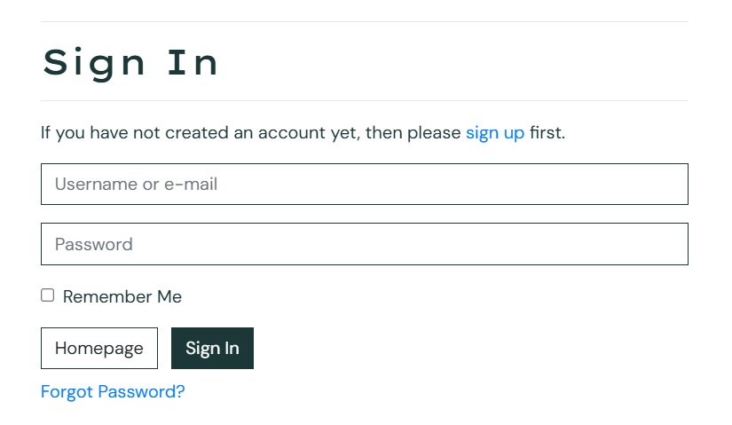 

**Register**  
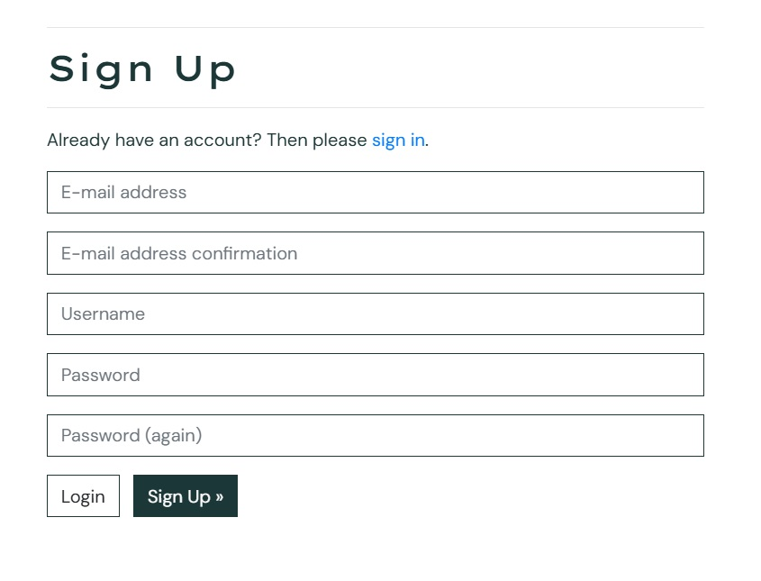 

**Logout**  
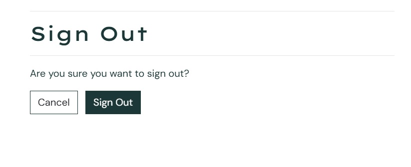 

### 3. Profile
The Profile page centralizes a user’s personal information and purchase history in a clean, responsive layout. 

The form lets users manage their saved contact and delivery information. Fields are pre-populated when available, include server-side validation with clear inline errors, and save updates securely to streamline future checkouts. Visual feedback is provided via consistent toasts after updating.

The Order History section is a scrollable list of previous orders in reverse chronological order, showing the order number, date, item count, and totals. Each entry links to a detailed, read-only order confirmation page that mirrors the checkout receipt for easy reference or proof of purchase. Line items display product titles, size options (where relevant), quantities, and prices, helping users quickly verify what was purchased. This section is particularly useful for tracking deliveries, calculating expenses, or reviewing sizing and preferences for future purchases. 

Together, these features provide a reliable self-service hub that speeds up repeat orders while maintaining privacy and data integrity.

**Profile**  
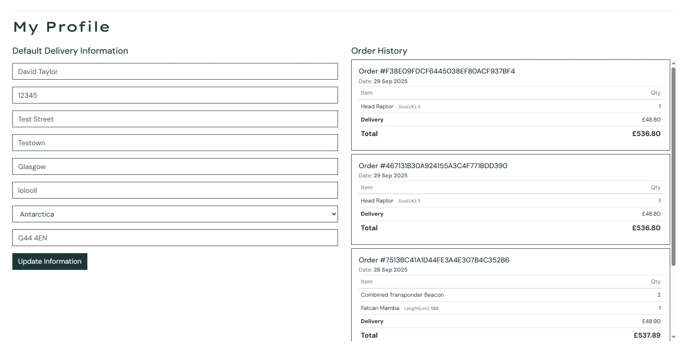 

**Profile collapsed (for mobile & tablet)**  
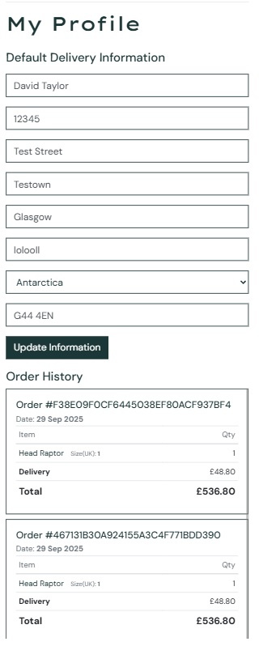 

### 4. Homepage
The index page welcomes users with a full‑width hero image that sets an alpine mood. The hero image has custom styling including a translucent gradient to reduce the vividity of the hero image and ensure the texts stays well contrasted and readable.

A prominent Shop Now call‑to‑action drives visitors directly into the product catalog for a fast start to browsing. Below, the About section introduces the brand’s purpose and values. 

The Our Partners area highlights a selection of trusted industry brands and services that Snow Depot collaborates with, showcasing the online skiwear ecosystem behind the store. 

Together, these sections quickly communicate the identity of Snow Depot, inspire confidence, and streamline the path to shopping, on any device. Content is lightweight, responsive, and accessible for all users.

**Homepage**  
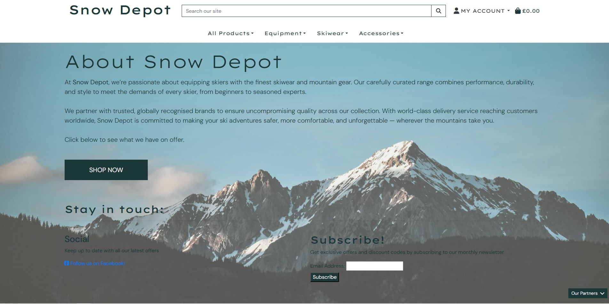 

**Homepage collapsed (for mobile & tablet)**  
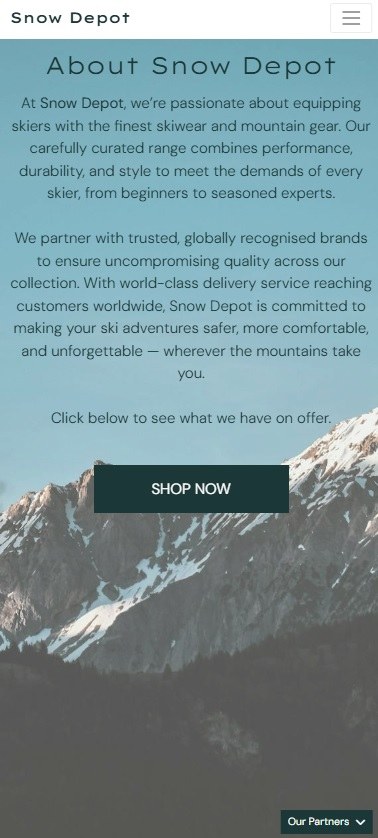 

**Our Partners Menu**  
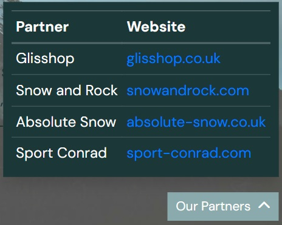 

### 5. Product Lists
The product listing pages present inventory in a responsive grid that adapts from single-column on small screens to multi-column layouts on tablets and desktops, ensuring consistent card sizing and readable spacing across devices. Lists are paginated for performance and clarity, maintaining fast load times while keeping navigation straightforward for larger collections.

Each product card features a clear image, product name, category and subcategory tags, price, and average rating, plus a quick link to view full details about the product. 

**Product list example - wide screens**  
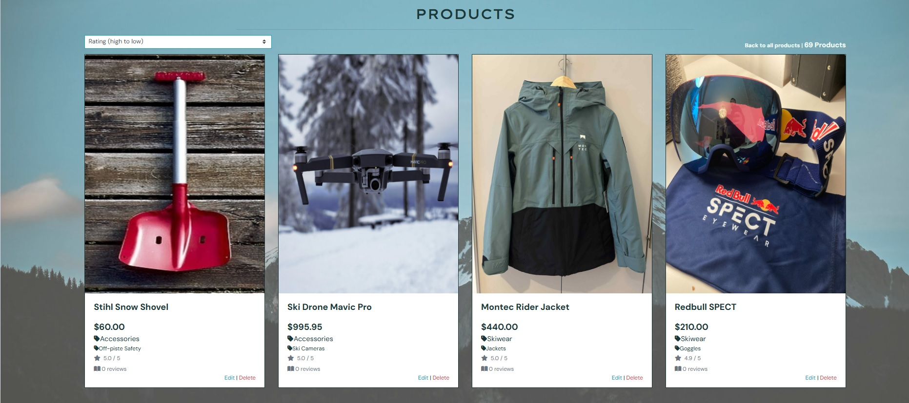 

**Product list example - tablet screens**  
 

**Product list example - mobile**  
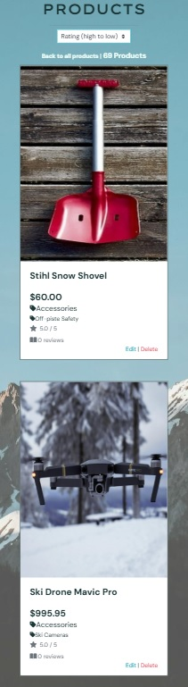 

Ordering tools allow sorting by price (low–high/high–low), rating, and name, helping prioritize value and/or quality. 
**Ordering drop-down**  
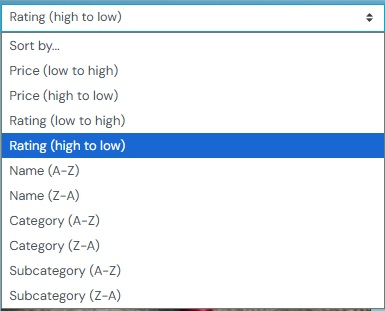 

Users can refine results with filtering by category and subcategory, narrowing the catalog to relevant gear in a few clicks. Keyword search supports rapid discovery by matching titles and descriptions. The number of search results returned is included, along with a convenient link back to the main product page.  
**Product search results**  
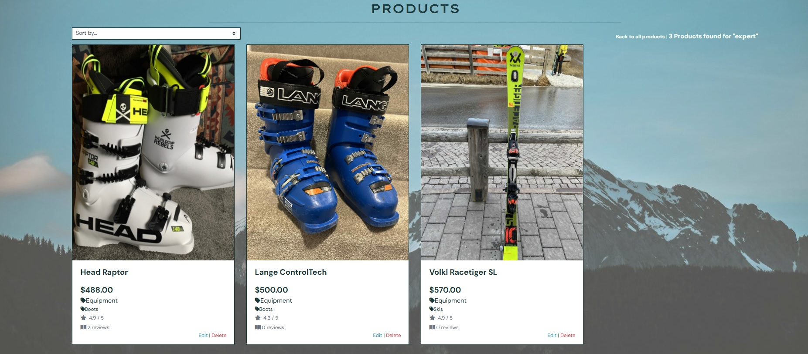 

### 6. Product detail pages
The product detail page focuses on clear evaluation and fast purchase decisions. A large, high‑quality product image sits alongside the key product details, including name, price, average rating, and categorisation. 

Below the primary section, users find a concise overview and an extended description with key specifications, materials, and care notes. Dynamic badges highlight discounts or limited stock when relevant. 

A quantity selector and a prominent Add to Basket call‑to‑action support quick checkout. If applicable, variant size controls are also available to customise preferences on clothing, skis, boots and poles. The Keep Shopping button returns the user to the product list.

The layout is fully responsive: content stacks vertically on small screens and shifts to a two‑column arrangement on larger devices for efficient scanning. 

For shop admins, edit and delete links for produce update or deletion are available with coherent styling to distinguish them from other content. 

Overall, the page blends rich product information with conversion‑oriented controls, guiding shoppers from assessment to purchase smoothly.

**Product detail page - large screens**  
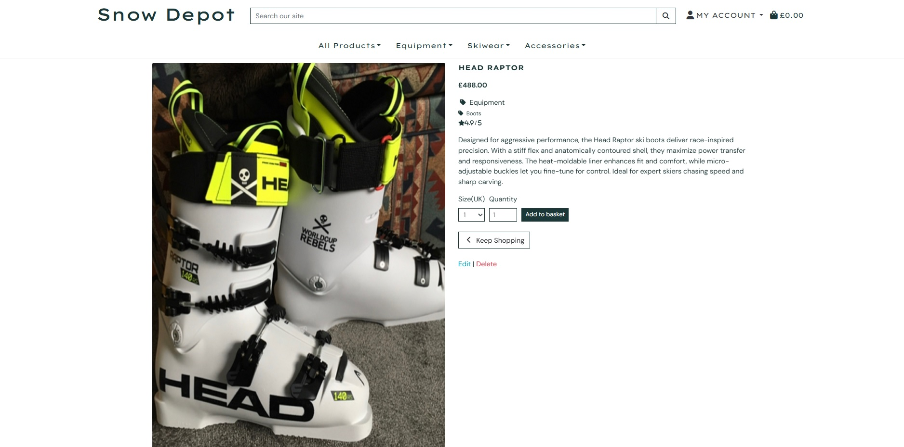 

**Product detail page - small screens**  
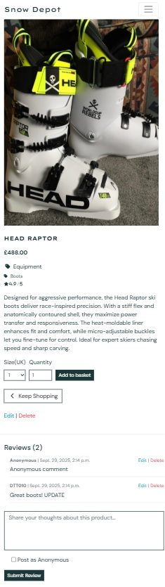 

**Size & Quantity inputs**  
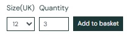 

### 7. Reviews
The reviews feature enables customers to share authentic feedback on products and helps shoppers make informed decisions. Signed-in users can submit their comment in a simple text entry box. The feature is integrated within the product detail page for each individual product, and appropriately modelled such that product-specific reviews can be displayed and updated.

After submission, review counts on the product cards are automatically updated, as well as the counter at the top of the reviews section. Reviews appear in reverse chronological order (latest at the top) with the reviewer's name if anonymous posting was not enabled, or anonymous if the box was checked. Users can post multiple reviews per product, and they can also edit their review or delete it using the appropriately styled links to the right side of each review.

**Review section - large screens**  
 

**Review section - small screens**  
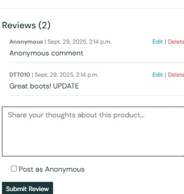 

Administrators may only delete reviews from other customers - they cannot make any edits to existing reviews from other users. Admins can still edit their own reviews (this would mainly be used for testing). In the instance below, the admin is `DTT010` and they have posted one public and one anonymous review. 
**Review section - admin view**  
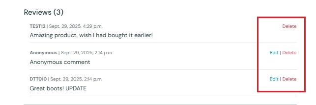 

Customers can edit or delete their own reviews, but cannot interact with reviews from other users. In the instance below, the customer is logged in as `TEST12` and can amend/delete only their own review. 
**Review section - customer view**  
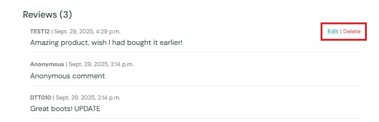 

Clicking to edit a review takes the user to a review editing page. The form persists the content of the review and the user's anonymity checkbox selection, which they can change if they wish. Clicking "Save Changes" redirects the user to the product detail page, on which the updated content is immediately visible. 
**Review section - editing**  
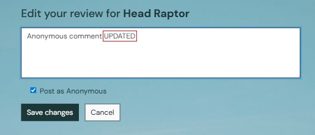 

**Review section - updated**  
 

### 8. Basket
The basket page provides a clear, responsive summary of items selected for purchase. 

Products are shown in a table (cards on small screens) with thumbnail, name (linked to details), selected options (e.g., size), unit price, quantity controls, and line subtotal. Users can adjust quantities inline or remove items entirely; inputs are validated and totals recalculate instantly with success/error messaging. The subtotal, delivery total and the grand total are clearly featured below the summary table. 

The Products model and basket functionality have been designed such that different quantities of varyingly sized items can be added, updated and removed from the basket without affecting other instances of the same item but of a different size.

Prominent action buttons let users continue browsing or proceed to secure checkout. The basket remains in the session locally between visits until cleared or converted to an order, helping users resume shopping where they left off. The layout is responsive, allowing the user to see a condensed version of the basket contents on mobile screens. 

**Basket - large screens**  
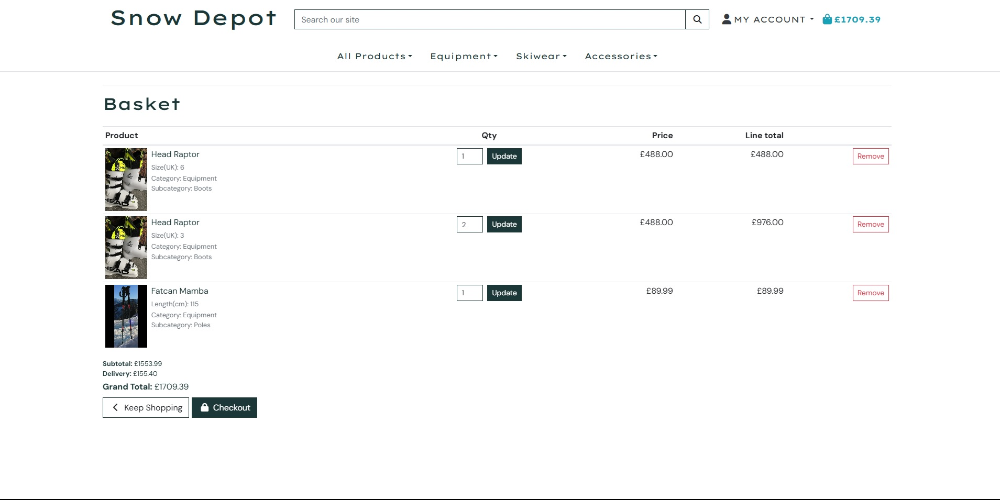 

**Basket - small screens**  
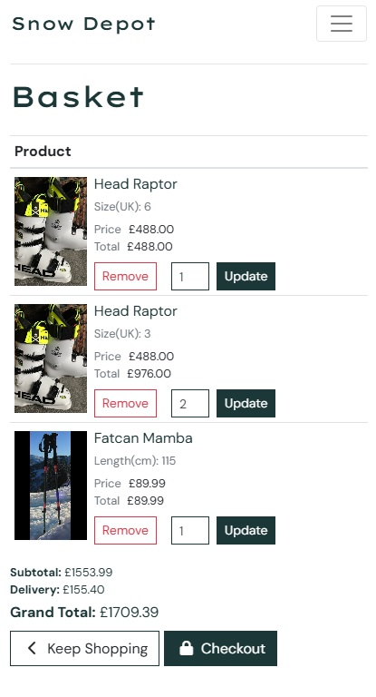 

An empty‑basket state redirects users back to shopping. 
**Basket - empty**  
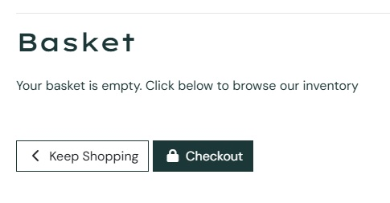 

### 9. Checkout
The checkout page provides a focused, secure flow to complete purchases. A responsive form collects contact email, shipping details, and optional phone number, with clear required fields (denoted by `*`), inline validation, and helpful error messaging if they add any invalid data. Beside the form, a condensed order summary is visible, showing itemized lines, delivery costs based on current rules, and a final total that updates with any changes.

The payment information section uses Stripe Elements for secure and reliable processing. A Payment Intent is created server‑side and confirmed client‑side with appropriate checks and retry attempts. Errors from Stripe are highlighted immediately, and a loading overlay prevents duplicate submissions during processing. On success, an order record is created and a confirmation email is sent. Stripe webhooks provide a secondary, reliable confirmation path, ensuring orders are finalized even if the client disconnects, reloads, or backs out during payment. Customers have the option to save their card details via custom Stripe functionality, once valid card information has been input.

Signed‑in customers can tick “Save this information” to store or update their default delivery details in their profile. On subsequent checkouts, saved details prefill the form and can be edited before payment. Address and contact updates update to the user's profile when selected, keeping future checkouts fast and accurate.

The checkout flow is accessible and optimized for performance, guiding users from review to secure payment with minimal friction.

**Checkout - large screens**  
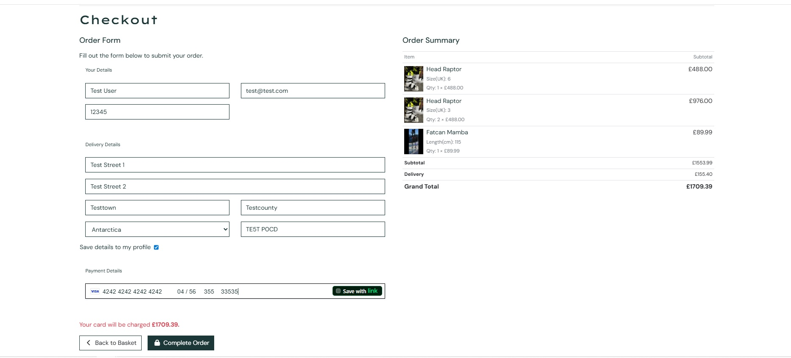 

**Checkout - small screens**  
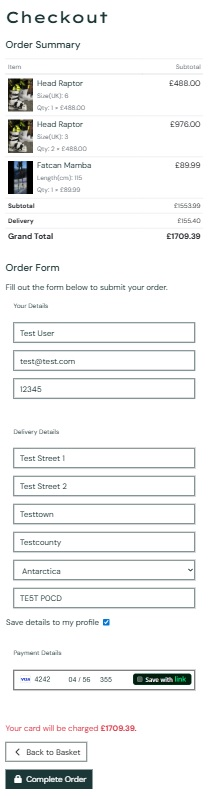 

**Checkout - appearance of processing overlay after submission**  
 

The default details on the user's profile page have been correctly updated since save info was selected at checkout. 
**Checkout - profile details updated**  
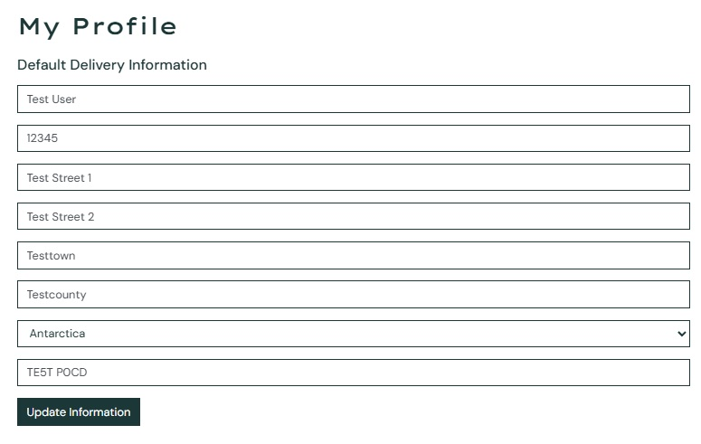 

### 10. Checkout Success
The checkout success page confirms the user's purchase and provides a clear, printable record. It displays the unique order code and key data such as order date and email used, with an itemized summary of products, quantities & size variants, unit prices, delivery, discounts, and the grand total. Shipping details are shown for verification.

For signed‑in users who chose to save their details, the page confirms that profile information has been updated; returning users can also jump to their Order History to review the receipt later.

The layout is responsive and accessible, with clear CTAs to continue shopping after checkout is complete. 

**Checkout Success - large screens**  
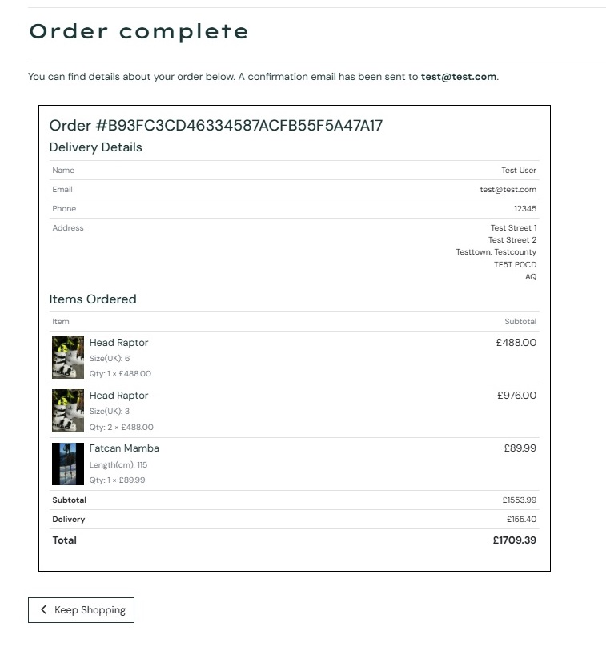 

**Checkout Success - small screens**  
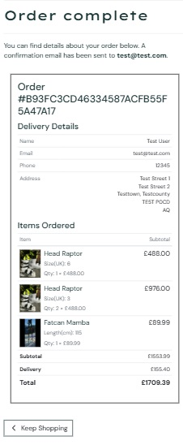 

### 11. Product Administration
The product administration area enables authorized administrators to manage the product catalog efficiently and safely. A simple form to add new products captures essential fields such as name, category and subcategory, price, ID, description, and rating. The form also includes a custom image uploader with a clear/replace control. Form inputs are validated server‑side and inline, with helpful error messages. When the form is saved, the product is immediately available in the storefront, and a success notice confirms creation.

Editing uses the same, pre‑populated form, streamlining quick corrections to info fields or imagery without re‑entering unchanged data. Image updates allow replacing or removing an existing file. After deletion, the product catalog and lists update and a success message is shown.

For convenience, Edit and Delete links are also exposed to admins on individual product detail pages, providing a fast path to maintenance. All admin routes are permission‑checked so only staff can access them. Non-admins are redurected to the homepage with an info message.

**Add product form - large screens**  
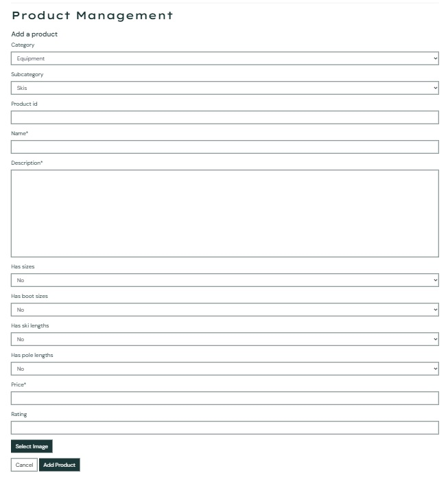 

**Add product form - small screens**  
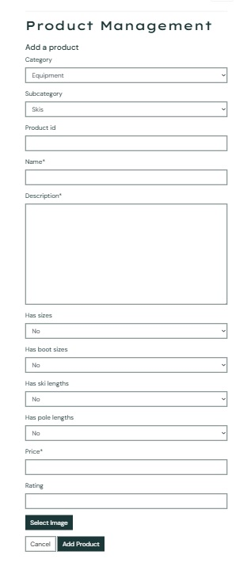 

**Edit/delete links - product lists**  
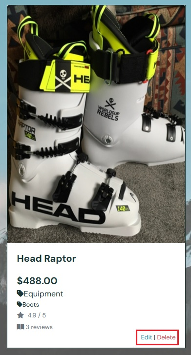 

**Edit/delete links - product detail**  
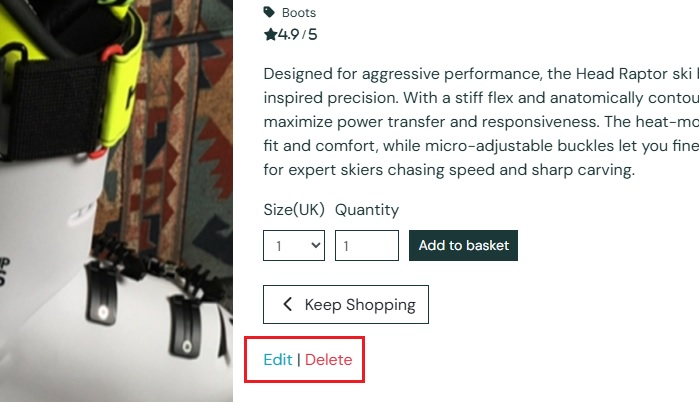 

For additional context, an examplar populated add product form can be see below, complete with test data. 
**Add product form - populated with test data**  
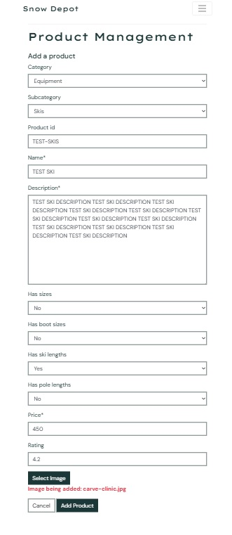 

After creation, the new product detail page for the product is displayed with correct fields, image, size selector (if applicable), etc. 
**Add product form - product detail result**  
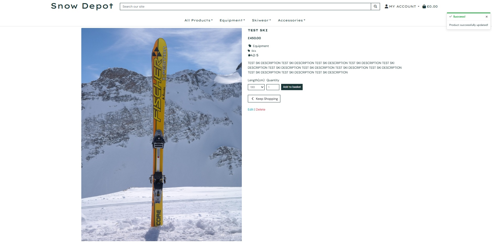 

The new product is also searchable on via all category/subcategory options...  
**Add product form - product list result**  
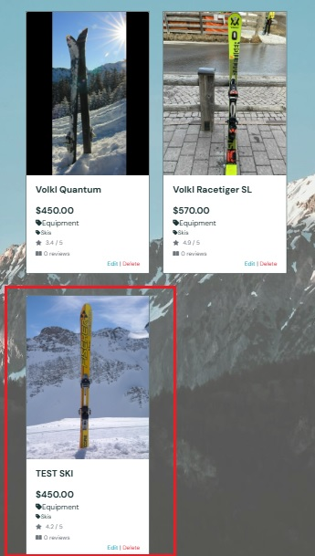 

...and by keyword search. 
**Add product form - product search result**  
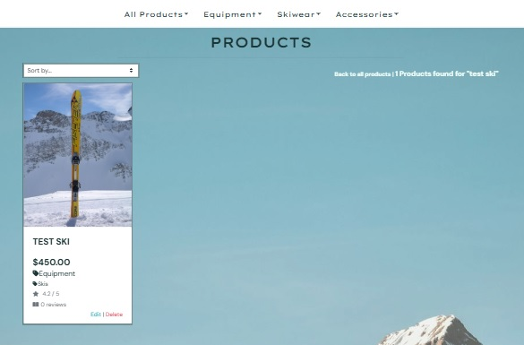 

### 12. Notifications system
The site uses lightweight, accessible toast notifications to provide immediate feedback in response to important actions. Three levels are used: Success (green) confirms completed tasks, Error (red) highlights problems that need attention, and Info (blue) shares helpful context or next steps. Toasts are non‑blocking, stack safely, auto‑dismiss after a short interval, and can also be closed manually.

Typical triggers include:
- Authentication: login, logout, sign‑up, password resets, and email verification prompts.
- Basket: item added, quantity updated, item removed, basket cleared; info toasts can show current subtotal and progress toward free delivery thresholds.
- Checkout: validation errors, Stripe card errors/SCA prompts (error/info), and payment success (success) with order reference.
- Orders: confirmation sent, webhook recovery notices if the page closed early, and any address/shipping changes.
- Profile: saved or updated default delivery information and account details.
- Reviews: submitted, edited, or deleted feedback.
- Product admin (staff): product created, updated, or deleted; image uploads replaced/cleared.

Where relevant, toasts include contextual links (e.g., “View basket,” “Go to order,” “Edit profile”) to keep users moving. 

Examplar notifications can be seen below.

**Example Success Notification**  
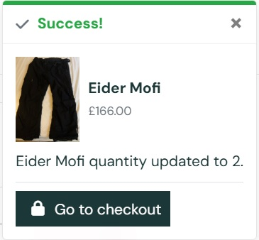 
In this example, the quantity of a product was updated in the basket.

**Example Error Notification**  
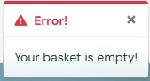 
In this example, the user tried to proceed to the checkout url without anything in their basket.

**Example Info Notification**  
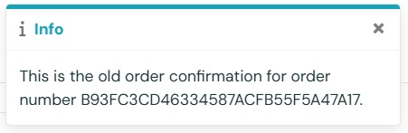 
In this example, the user is viewing an old checkout success confirmation for a previous order.

### 13. Customised Emails
Account email verification is handled by Django Allauth. On sign‑up, users receive a verification email containing a secure, time‑limited link. Following the link confirms the address and unlocks full account functionality. Templates define the subject and body for consistent branding, and users can request a resend if needed. 
**Account verification email**  
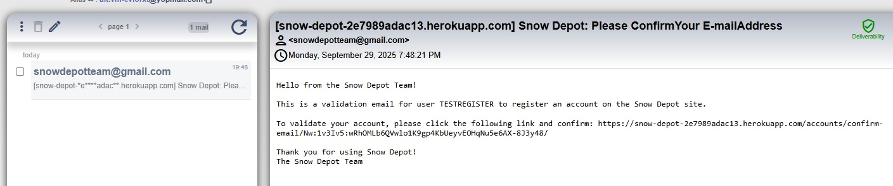 

Order confirmation emails are sent automatically after a successful checkout. Once Stripe confirms the Payment Intent, the server creates the order and dispatches an email summarizing the purchase. Emails use template-driven content for clarity - order number, items, quantities, prices, delivery cost, totals, and shipping details are included. 
**Order confirmation email**  
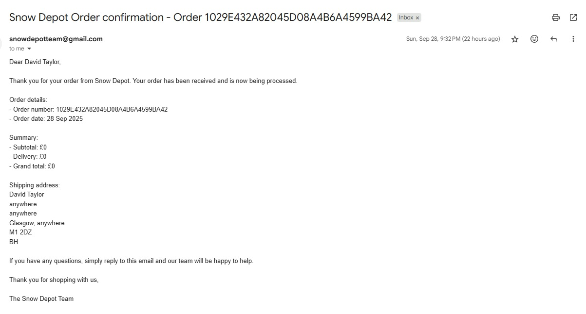 

### 14. Other features

#### Robots.txt
The site includes a robots.txt file to instruct browser crawlers what to index. The file can be accessed at the `/robots.txt` url. Direct link: https://snow-depot-2e7989adac13.herokuapp.com/robots.txt

#### Sitemap.xml
The sitemap was generated by Django's sitemap framework and can be accessed at the `/sitemap.xml` url. Direct link: https://snow-depot-2e7989adac13.herokuapp.com/sitemap.xml

## Models
Dbdiagram was utilised prior to development to plan the required models, relationships and data structure for all of the components of the online shop. This tool supports the development of linked Entity-Relationship Diagrams to help enivision the structure and interactions between the required models. 

**Database Structure** 
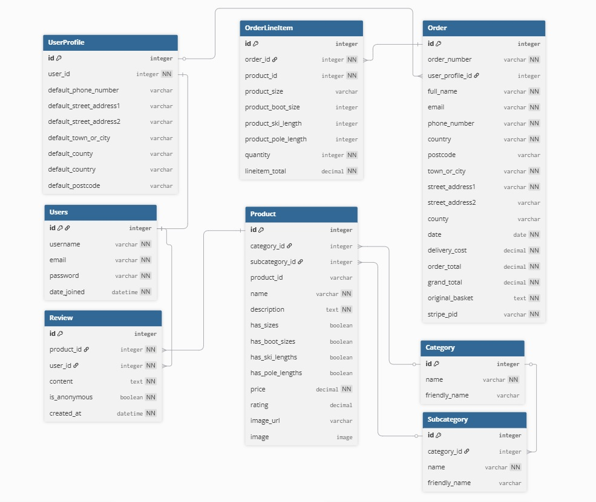 

### 1. Users
This model represents authenticated customers and admins using Django’s built-in User model. Stores username, email, and credentials, with authentication/registration handled via Allauth. Each User has a one-to-one UserProfile for default delivery details. Users can author multiple Reviews (one-to-many). Orders are indirectly linked via the user’s profile, enabling order history retrieval without duplicating account data. 
**User Model** 
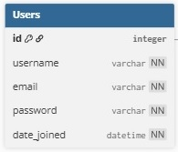 

### 2. UserProfile
Extends the User model with default delivery information (phone, addresses, city, county, country, postcode). A one-to-one relationship ensures each account has at most one profile. Profiles are associated with many Orders (one-to-many), providing a basis for order history and enabling checkout forms to prefill saved details. 
**UserProfile Model** 
 

### 3. Product
Core product model containing name, description, pricing, rating, media, and size typing (sizes, boot sizes, ski/pole lengths) where appropriate. Each Product belongs to a Category and Subcategory, supporting flexible navigation and filtering. Products are related to OrderLineItems (one-to-many), where quantity and chosen options are captured for each order. They also aggregate customer feedback through Reviews (one-to-many). 
**Product Model** 
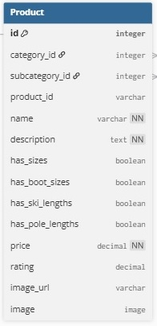 

### 4. Category
Top-level grouping used to organize the product catalog and facilitate navigation. Categories serve as parents of Subcategories (one-to-many), enabling both broad and refined browsing structures. This dual mapping allows products to be grouped at varying depths depending on merchandising needs, while keeping URLs, filters, and menus predictable. 
**Category Model** 
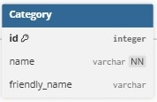

### 5. Subcategory
Secondary-level grouping nested under a single Category (many Subcategories per Category). Subcategories refine product discovery (e.g., Skis, Boots, Jackets) and can contain many Products (one-to-many). They inherit context from their parent Category while enabling targeted filtering. 
**Subcategory Model** 
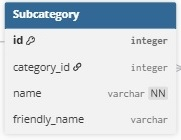

### 6. Order
Represents a completed checkout, capturing critical information such as purchaser details, shipping address, and order total. Orders optionally link to a UserProfile (many Orders per profile), allowing authenticated users to view history while still supporting guest checkouts. An Order aggregates many OrderLineItems (one-to-many) and calculates totals from those items. 
**Order Model** 
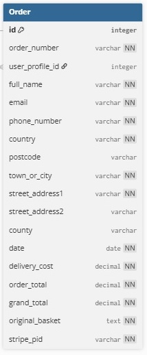

### 7. OrderLineItem
Line-level record linking an Order to a specific Product with quantity and selected options (size/length) where appropriate. Each line computes its own total from the product price and quantity, contributing to the Order’s aggregate totals. Many line items belong to one Order; each line references exactly one Product (and individual sizes the same product, if multiple are present). Cascading behavior ensures line items are cleaned up with their parent order, maintaining data integrity. 
**OrderLineItem Model** 
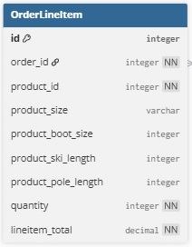

### 8. Review
User-generated feedback on Products, storing author, content, creation timestamp, and optional anonymity. Each Review belongs to one Product and one User (many reviews per product; many reviews per user). Reviews are ordered newest-first and indexed by product and date for fast retrieval on product detail pages. 
**Review Model** 
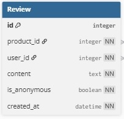

## Testing

### Manual Testing
All manual testing detailed here was conducted both on a local server, as well as the main deployed version after development was completed. A detailed manual testing plan was implemented to ensure the integrity of the site's functionality.

#### **Browsing Process**
- Main homepage loads upon visiting the site index, and the CTA Shop Now button correctly redirects the user to the All Product list.
- Navigation elements were tested exhaustively on all screen sizes:
  - All nav element links return the correct url and page
  - Nav elements are consistently styled, and drop-down lists function as expected
  - All action buttons e.g. Checkout, Back to Shopping, Cancel are consistently styled and redirect users to the correct page, or submit the appropriate form
  - The search bar and submit search element work correctly
- All product lists worked as expected, with users being able to see lits of all products at varying levels of categorisation and refinement including:
  - Full unfiltered product lists
  - Category specific lists - Equipment, Skiwear, and Accessories
  - Subcategory specific lists - Skis, Boots, Underlayers, Off-Piste Safety, etc.
  - Lists ordered by attribute in ascending or descending order upon selection - A-Z, rating-based, price-based, name-based and category-based
- Search functioned as expected, with the search reliably returning any product with matching keywords in the name, description or ID
- Product links appropriately linked to product detail pages for each product.

#### **Managing Basket**
- Tested that user can enter a quantity in the appropriate selector on the product detail page, and the value is correctly restricted to 1-99 - the input is locked between 1 and 99.
- Conducted individual testing on item categories with sizes. I ensured that each the appropriate size/length selector appeared on all pages, with the correct input limits. I also ensured that the basket was correctly populated when different sizes of the same item were added in the same order. Checked sizing worked with all products including:
  - Clothing with size (mainly skiwear) = XS/S/M/L/XL
  - Boots with UK shoe size = UK size 1 to 14
  - Skis with ski length = 130-200cm
  - Poles with pole length = 80-130cm
- Confirmed that the "Add to basket" CTA button on the product detail page functions correctly, and the expected success notification appears in the messaging system.
- Confirmed that the "Go to basket" button within the success message correctly directs the user to the basket
- Tested the functionality of the "Update" button and quantity input. As expected, selecting a new quantity and clicking Update results in the page being refreshed with the new basket total calculation and line item summary.
- Updating an item's quantity within the basket to 0 correctly results in the item being removed from the basket altogether.
- Confirmed that the product names on the basket page correctly link back to the product detail page for that product, ensuring the user can go back and view the details at any time prior to purchase.
- The appropriate empty basket screen is displayed when the user visits the basket page via nav element with no items in the session, or after they remove all items from within the basket page itself.
- Confirmed that the basket contents and order total are retained between sessions, unless the user logs out or clears their session data

#### **Checkout**
- Conducted exhaustive testing of the validation of all details & delivery fields, using normal, extreme, and exceptional data where appropriate.
- Confirmed that the order summary loads correctly with a full list of all ordered items, totals and delivery costs.
- Confirmed that the order total is correctly calculated, the delivery cost of 10% of the order is correctly applied to the total, and that the total advised in the danger text below the card payment section matches the total displayed under the summary.
- Tested that the "create an account" and "login" links appear correctly with the prompt to save information for users who are not logged in/registered
- As a logged in user, I ensured that the "save details" functionality worked correctly by completing checkout with the box checked and unchecked, and checking that the default details on the profile page updated/did not update, respectively.
- Checked that the form was rejected when user tries to complete an order without filling in required fields, such as name, street address line 1, etc. The user is correctly redirected to the form with existing data loaded, and clear error messages below fields where data was missing.
- During development, as part of the process for establishing the webhooks and handlers, I conducted manual testing of simulated payments using the Stripe CLI and listeners. This helped me to troubleshoot issues with valid payments and ensured that valid transactions were being correctly processed by Stripe.
- While conducting testing on the deployed version, I encountered a major bug causing completed transactions to result in a Server Error 500 in every instance. I used the Stripe developer dashboard to identify and resolve the issue - further info in "Bug fixes during testing" section.
- While the project scope did not include the integration of real payments, it was still important to ensure that payment functioned correctly and completed orders were stored in the database regardless of simulated "back-out" or early reloads during the payment process:
  - Removed `form.submit()` from Stripe elements JS to simulate disconnection at point of payment and confirmed via django admin panel that the order was still placed correctly, and retrievable in Order History. I also confirmed that the webhook handler functioned correctly and that the appropriate events (e.g. paymentIntent.succeeded, charge.created) appeared in my Stripe developer panel.
  - Placed a normal order with the standard Stripe dummy card number to simulate a successful transaction. This correctly resulted in the appropriate order success notification, order confirmation email arriving at the user's email account, and redirection to the checkout success page, populated with the correct order details.
- Confirmed that the Stripe auto-fill option works to save user's card details on the site so that the card information is automatically populated on next checkout visit. 

#### **Account interactions**
- Ensured that new superuser accounts could be created via terminal and immediately accessible both on the front-end account system and the django admin panel.
- Confirmed that links to account-related pages on the navigation bar are correctly loaded depending on authentication status, and that the links direct users to the appropriate authentication page.
- Tested the full registration process from start to finish:
  - On a fresh session, went to register page and completed details with test placeholders
  - Upon submitting account details, was redirected to the email verification notification.
  - Received the customised account verification email with a working link to complete verification
  - Verification link functioned correctly and complete verification button finished the process, with appropriate toast notification
  - Attempted login with new account detail with success and received standard login confirmation toast notification
- Confirmed that cross-referencing links (e.g. login link on register page) work correctly
- Confirmed that account sign-in status persists between sessions unless user logs out or clears their session data
- Tested the password reset functionality from allauth worked correctly

#### **Profile page**
- Conducted exhautive testing on the default delivery information form using normal, extreme, and exceptional data where possible.
  - Tried to add names, street addresses, postcodes etc. exceeding the maximum character limit defined by the model but was correctly restricted to max character limits on the form fields themselves.
- The "Update Information" button works correctly, reloading the page with all updated details loaded.
- Upon revisiting the checkout page, the details are appropriately populated with the existing details in my default delivery information. Vice versa, upon completing checkout with different details and the save-info box checked, the profile details are correctly updated.
- Confirmed that the Order History section correctly displays all of the orders associated with the given user (tested by completing orders and then logging into other accounts and ensuring that the same order was not present in another user's history).
- Confirmed that the content of each Order History card is accurate including key data on line items, quantities, sizes etc. and a correct delivery cost and total.
- The orders are displayed in reverse chronological order as intended, with the most recent orders being added to the top. I confirmed this worked immediately after purchase, and persisted between sessions.
- The Order History section correctly moves to a scrollable format when the number of orders causes the height of the section to exceed screen height.

#### **Review functionality**
- The review addition, editing and deleting functionality and accessibility were tested comprehensively across guest, logged-in user, and admin authentication levels.
  - Guest: Confirmed that users who are not logged in can only view reviews at the bottom of product detail pages.
  - Logged-in user: Confirmed that logged-in users are able to submit a review via the form, and the page immediately reloads with the review added to the bottom. The user is then able to edit their own comment via a separate editing page, and be redirected back to the product detail page after update or cancellation. The user is also able to delete their comment by clicking the relevant link.
  - Admin: I tested that admins are able to edit and delete their own comments (mainly used for testing), and are restricted to only be able to delete the comments from other users. This ensure the integrity of the reviews, while still allowing admins to remove inappropriate comments.
- The correct username, date & time, and content is posted for each comment.
- I confirmed that the review counter on the page, as well as the counter on the individual product cards in product lists, are correctly updated whenever a comment is added, updated, or removed.
- I tested the review form with normal and extreme data (i.e. leaving a standard length comment, and a comment of length 2000 chars) which submitted without issue. The input correctly limits users when they try to exceed the maximum character limit.
- When users attempt to edit their comment, they are taken to the appropriate url to edit their specific comment. I tested the security of this functionality by logging into another account and attempting to go directly to the editing url for another user's comment - the edit review view has functionality to protect against this, redirecting the user to the homepage and displaying an relevant info message.
- The "Post as Anonymous" checkbox works correctly, allowing the user to post an anonymous comment. The preference on the checkbox correctly persists through to the edit review page. 
- I confirmed that all users regardless of authentication status are able to see all reviews on all products - the restrictions correctly only apply to editing and removal access.

#### **Admin panel**
- The Django admin panel was thoroughly tested across all models, including Users, Products, Orders, as well as ensuring back-end account operations such as email validation could be achieved outside of the standard registration process. 
- Full CRUD functionality was verified to ensure superusers could reliably create, read, update, and delete records. 
- Testing covered normal, extreme, and exceptional inputs for model fields, confirming that the system handled data validation as expected. 
- Successful operations produced the correct database changes, while invalid inputs triggered appropriate error messages or rejections. 

#### **Styling**
Manual testing played a key role in refining the project’s front-end styling. Bootstrap classes and custom CSS rules were systematically reviewed to identify inconsistencies, redundancies, and layout issues. The application was run on a local development server, enabling continuous testing of visual changes in real time. Chrome DevTools was used extensively to inspect elements, trial modifications, and confirm their effects before committing changes to stylesheets. This approach allowed targeted adjustments to be made efficiently, and styling was tested across multiple browsers to confirm consistent rendering. Accessibility was checked through color contrast testing and ensuring appropriate use of headings and semantic HTML.

#### **Responsiveness**
Responsiveness was tested throughout development to ensure the site displayed correctly across a range of devices and screen sizes. Using Chrome DevTools, the application was viewed in simulated environments for mobile, tablet, and desktop resolutions. Layouts, navigation menus, and interactive components were checked to confirm that elements resized, stacked, or collapsed appropriately without breaking page structure. Special attention was given to grid-based layouts, form inputs, and media elements, verifying that Bootstrap’s responsive utilities and custom CSS rules behaved as intended. Testing also included rotating devices between portrait and landscape modes to identify inconsistencies. Manual checks were performed on physical devices where possible, complementing browser simulations. This iterative testing process helped identify and resolve issues such as overlapping text, misaligned elements, and scroll-bar overflow, resulting in a consistent and user-friendly experience across all platforms.

#### **Fixes & Improvements from manual testing**
- Noticed that all icons in the footer were being targeted with a 200% size rule which had only been intended for the social media icons. Resolved by adding more specificity to the existing rule.
- Identified a missing minimum value on the "number of guests" widget on the booking form, resolved by setting `'min': '1'` in the widget's attributes in `booking/forms.py`.
- Identified a missing minimum value validation on the "duration" field of the Reservation model, resolved by adding `validators=[MinValueValidator(1)]` to the duration field and migrating the changes.
- Multiple instances of redundancy within style rules e.g. applying color/background style to elements which have already inherited this from a lower specificity rule; applying styles already managed by Bootstrap class.
- Resolved an issue causing the table assignment functionality to break using manual testing with terminal print statements added to the `create_reservation` view. 

### Automated Testing

#### **Mock data testing**
Django's built-in testing functionality was used for testing key components of the booking system, including tests for the reservation form and functional views related to bookings.

The tests in `booking/test_forms` provides test cases for the functionality of the booking form, ensuring form validity and testing the constraints for each field.

The tests in `booking/test_views` verifies the functionality of the `create_reservation`, `edit_reservation` and `delete_reservation` views.

#### **Lighthouse testing**
The Lighthouse testing functionality within Google Chrome Developer Tools was used to assess the performace and accessibility of each site page on the deployed version of the application. The results for each page are summarised below: 
 
The main deficit in Performance rating, relative to the other metrics, was the use of a high resolution hero image for the background on all pages of the site. Initially, an even higher resolution image was being used and resulted in significantly lower Performance scores (mid 60s for most pages). Lower resolution images were tested until sufficient compromise between image quality and page load was found.

#### **HTML Validation**
W3C HTML Validation Service was used to validate all templates used throughout the site, including:
- base.html
- homepage.html
- reservation_form.html
- reservation_list.html
- menu_list.html

All major issues and errors reported by W3C were due to the use of Django Templating Language (DTL) within the html documents (e.g. ``, ``) and could safely be ignored. 

**Examples of errors thrown due to W3C not recognising DTL** 
 
 

One minor issue was detected on login.html, logout.html and signup.html authentication pages where a trailing slash had been left on an input element, which was resolved immediately. 

**Trailing slash issue** 
 

#### **CSS Validation**
W3C CSS Validation Service was used to validate the static stylesheet after tidy up had been conducted. No errors were found. 
 

#### **JS Validation**
The online JSHint validation tool was used to check the static javascript file. No errors were found. 
 

#### **Python Validation**
Utilised [Code Institute's Python Linter](https://pep8ci.herokuapp.com/) for PEP8 adherence & validation. A python linter (Flake8) was also used within the IDE during development meaning that the majority of issues were fixed during development. 

I was unable to resolve one type of linter error reported on my `booking/views.py` file. Due to the level of indentation and length of variable names requried for the booking system logic, and the lack of a suitable place in these lines to add a linebreak, several lines in this file are longer than the 79 character limit. 

**Linter errors on booking/views.py** 
 

**Example of "line too long" error** 
 

### Bug fixes during testing

## Features for future development
The following features for future implementation are inspired by the "could have" user stories which are yet to be accomplished by the current version of the application. 

I have focussed on the following 3 improvements as I believe these would be the most immediately impactful for the functionality and user experience. 

### Improve product imagery 

### Integrate real payments with Stripe

### Bulk product upload

### Wishlist

## Key packages
- **Django==4.2.23**: The framework used to build the application.
- **django-allauth==0.57.2**: Django application with pre-built templates for user registration and account management, including password protection.
- **django-crispy-forms==2.4**: Django application used for conveniently styling and structuring the reservation form.
- **django-summernote**: Django application for improving admin panel functionality for specific models and rich text editing.
- **gunicorn==20.1.0**: Python WSGI server for running the application.
- **psycopg2==2.9.10**: PostgreSQL database adaptor for python.
- **whitenoise==5.3.0**: Used to conveniently serve static files prior to deployment with `collectstatic` command.

## Django imports utilised
- **django.contrib**: messages
- **django.shortcuts**: render, redirect, get_object_or_404
- **django.test**: TestCase
- **django.urls**: path, reverse
- **django.utils**: timezone
- **django.views**: generic
- **django.contrib.auth.decorators**: login_required
- **django.contrib.auth.models**: User
- **django.core.validators**: MaxValueValidator, MinValueValidator

## Deployment

### Pre-deployment Requirements
- Ensure you have a GitHub repository set up for the project.
- Set `debug` to `False` in `settings.py`
- Ensure that `.herokuapp.com` is appended to the list of `ALLOWED_HOSTS` in `settings.py`
- Ensure `whitenoise` is correctly installed use `python manage.py collectstatic` to update any changes to static files, then commit and push these files to the project repository before deployment.
- Ensure `SECRET_KEY` is correctly set up as an environment variable and has been added as a config var to the Heroku app via Settings tab.
- Create a "Procfile" with `web: gunicorn the_otter_mill.wsgi` to link the WSGI server for running the application.
- Push any updated requirements to `requirements.txt`.

### Steps to deploy (via Heroku)
Please note that these steps assume you have a verified Heroku account and an eco dynos subscription.
- Log into Heroku dashboard.
- Create a new app with a unique name for the project.
- On the "Deploy" tab, enable GitHub integration by clicking "Connect to GitHub".
- Type in the name of your project repository you want the app to link to.
- On the "Resources" tab, select the "Eco Dyno" container to run the project.
- At the bottom of the deployment page, select the `main` branch and manually deploy.
- Open the deployed application.

## Credits

### Concept
Project Example Idea 1 recommended within Code Institute's Portfolio Project 4 Assessment Guide was the main inspiration for this project.

### AGILE Project Management
Github project dashboard and issues were used for AGILE development, including: development of User Story templates; labels for prioritisation (must-have, should-have, could-have); and a dashboard for tracking User Story progress (to-do, in progress, done).

### Code
- **Stack Overflow** was used extensively for general troubleshooting, and for specific fix with enforcing a positive number on Django model via `minValuValidator`: https://stackoverflow.com/questions/54858123/how-do-i-enforce-a-positive-number-on-my-python-django-model-field
- **Bootstrap Documentation** for general troubleshooting on styling and classes, and a specific fix for right-aligning table items with the `flowreverse` class: https://getbootstrap.com/docs/4.0/utilities/flex/
- **Django documentation** for general guidance on built-in Django functions and imports used extensively throughout the project: https://docs.djangoproject.com/en/5.2/.
- Reutilisation of navbar and footer elements from previous Ski Trossachs project (my CI Portfolio Project 1): https://github.com/DTT2411/CI-Portfolio-Project-1.

### Deployment
- **Heroku** - Cloud application platform used to host the project. Link to Heroku: https://www.heroku.com/.

### Data Modelling
- **Dbdiagram** (https://dbdiagram.io/) was used to help plan and visualise the models required for the booking and menu apps within the project. 

### Content
- **Bootstrap** classes were used extensively throughout the templates to improve responsiveness of html elements and reduce the need for additional custom CSS styling. https://getbootstrap.com/docs/5.3/getting-started/introduction/.
- **Google Fonts** for custom fonts used throughout site. Link to embed code used: https://fonts.googleapis.com/css2?family=Eagle+Lake&family=Gudea:ital,wght@0,400;0,700;1,400&display=swap.
- **Coolors** (https://coolors.co/) was used to identify a suitable colour scheme for the site.
- **Pixabay** was used to identify a suitable hero-image for use as the background image for all site pages. Direct link to image: https://pixabay.com/photos/landscape-building-architecture-1303550/
- **Amiresponsive** (https://ui.dev/amiresponsive) was used to generate the mock-up image for the readme.
- **Balsamiq Wireframes** (https://balsamiq.com/) was used extensively during planning to guide the structure and layout of the website.
- **WebAim Contrast checker** (https://webaim.org/resources/contrastchecker/) was used to check the viability of the colour scheme.
- **Flaticon** was used to source the icon for the tab in browser. Attribution link: https://www.flaticon.com/free-icons/water-mill
- **Font Awesome** for iconography, link to personal kit: https://kit.fontawesome.com/3af9805755.js

### Testing
- **W3C HTML Validator** (https://validator.w3.org/) was used for testing HTML.
- **W3C CSS Validator** (https://jigsaw.w3.org/css-validator/) was used for testing CSS.
- **JSHint Validator** (https://jshint.com/) was used for testing JavaScript.
- **Autoprefixer** (https://autoprefixer.github.io/) was used to ensure portability of stylesheet across different browsers.

### Special Thanks
Special thanks to my mentor Cans and all of the amazing CI tutors for their unwavering support, quick responses, and kind encouragement. 