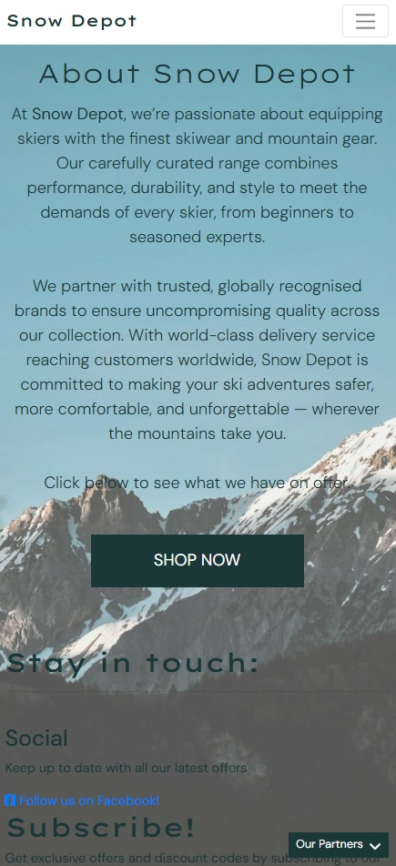
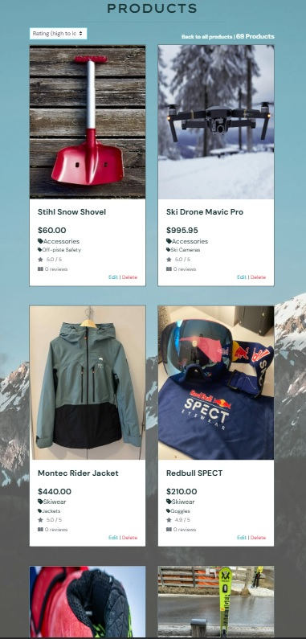
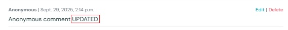

# Snow Depot

## Project Description
**Snow Depot** is an e-commerce web application for buying premium ski equipment, apparel, and accessories. Built with Django, the site aims to deliver a fast, intuitive, and secure shopping experience across devices. Customers can browse a curated catalog with rich filtering and sorting by category, subcategory, name, rating, and price. Product detail pages display comprehensive information and support size selection where appropriate, while a session-based basket enables quick additions, adjustments, and removals with real-time feedback via clear and easily visible notifications.

Checkout is powered by Stripe, using PaymentIntents for secure card processing, and includes order validation, line item creation, delivery calculation, as well as customised confirmation emails. Authenticated users can manage a profile with saved defaults for contact and address details to speed up future purchases, and view their order history. The reviews feature lets users submit and edit product reviews, enhancing trust and discoverability.

Administrative users can add, edit, and delete products through protected views. The project supports media and static file hosting on Amazon S3 in production, and is deployed as a Heroku application. SEO considerations include a robots.txt and dynamic sitemap.xml to help search engines index key pages. The front end uses Bootstrap ubiquitously for responsive layouts and consistent UI, with reusable templates and context processors to keep the experience cohesive and maintainable.

## Link to application
The application can be accessed directly at this dedicated link: https://snow-depot-2e7989adac13.herokuapp.com/

## GitHub Repository
The GitHub repository for the project can be accessed at: https://github.com/DTT2411/snow-depot

## Project Methodology
The project followed an Agile methodology throughout development, with all progress tracked transparently in GitHub Projects. User Stories formed the backbone of the process, ensuring features were developed in line with user needs and project goals.

Stories were prioritised into “must-have,” “should-have,” and “could-have” categories to define the minimum viable product and guide development focus. Work was managed using a Kanban-style workflow, where stories moved across “To-Do,” “In Progress,” and “Done” columns to clearly show progress and bottlenecks.

Each story included well-defined acceptance criteria, providing measurable conditions for success. Stories were only marked as complete when all acceptance criteria had been satisfied, ensuring quality and consistency across the project deliverables.

This structured yet flexible approach supported iterative development, continuous feedback, and the delivery of a reliable product aligned with stakeholder requirements.

## User Stories

### Authentication and Profile
|Name|Description|Priority|Status|
|---|---|---|---|
|Register Account|As a customer I can register for an account so that I don’t need to fill my details in every time I make a purchase|Must Have| Complete| 
|Log in to account|As a customer I can easily log in to my account so that I can start browsing without delay.|Must Have| Complete| 
|Log out of account|As a customer I can easily log out of my account so that I can avoid staying signed in unnecessarily.|Must Have| Complete| 
|Add contact and shipping details|As a customer I can add my default contact and shipping details to my profile so that I can have a quicker checkout process.|Must Have| Complete|
|Track previous orders|As a customer I can see a list of my previous orders so that I can keep track of what I've purchased and retain details of past orders in case there have been any issues.|Should Have|Complete| 
|Account validation|As an administrator I can ensure customers need to sign up with a valid email to login so that accounts are secured at activation and we prevent spam in the reviews.|Could Have| Complete| 

### Navigation and viewing products
|Name|Description|Priority|Status|
|---|---|---|---|
|Navigate easily|As a customer I can use a navigation bar to easily navigate around the site so that I don't struggle to find what I'm looking for quickly.|Must Have| Complete| 
|View list of all products|As a customer I can view a list of all products so that I can browse through the entire collection.|Must Have| Complete| 
|Search through categories|As a customer I can select a category of products to look through so that I can narrow down my search.|Must Have|Complete|
|Filter products|As a customer I can filter products by subcategory so that I can find a well-rated product which fits my needs and price-range.|Must Have|Complete|
|View detailed product information|As a customer I can see comprehensive product information for each individual item so that I can be fully informed about the product before buying.|Must Have|Complete| 
|Relevant product images|As a customer I can see relevant images of each product so that I can quickly assess if I like the appearance/construction and would want to buy it.|Must Have|Partially Complete*|
|Order listed products|As a customer I can order the products when viewing them in a list on screen so that I can sort by my preferences.|Should Have| Complete| 
|View site information|As a customer I can see basic information about the site so that I can determine upon first visiting whether it’s right for my needs.|Should Have| Complete| 
|Search products|As a customer I can search through products using keywords so that I can easily find a suitable product even if I'm not sure what subcategory to look in.|Should Have| Complete|
|Links to partners|As an administrator I can direct customers to a partners section on the homepage so that we can encourage customer engagement with partners as part of our mutual relationship.|Should Have|Complete| 

### Adding and purchasing products
|Name|Description|Priority|Status|
|---|---|---|---|
|Prevent invalid transactions|As an administrator I can prevent invalid or unfinished transactions from going through so that we avoid any issues with transactions being made without the order being correctly logged in the database.|Must Have|Complete| 
|Register Account|As a customer I can register for an account so that I don’t need to fill my details in every time I make a purchase|Must Have| Complete| 
|View basket|As a customer I can see a basket containing all of the items and relevant info about each in my order before checkout so I can see details of what I am purchasing at a glance.|Must Have|Complete| 
|Add to basket|As a customer I can easily add an item to my basket so that I can include it in my order.|Must Have|Complete| 
|Remove from basket|As a customer I can easily remove an item from my basket so that I can prevent it being ordered if I've changed my mind about buying.|Must Have|Complete| 
|Secure purchase|As a customer I can securely complete the purchase of products so that I can receive my order.|Must Have|Complete| 
|Update items in basket|As a customer I can change the quantity of individual items in my order so that I can correct any mistake made when adding to basket.|Should Have|Complete| 
|View running total|As a customer I can see a running total for the order in my basket so that I can track my potential spending.|Should Have|Complete|
|Check before remove item|As an customer I can receive a check before deleting an item from my order so that I avoid accidental deletions.|Could Have|Not Complete*|

### Product reviews
|Name|Description|Priority|Status|
|---|---|---|---|
|View reviews|As a customer I can see reviews for products so that I can get feedback from other purchasers about the product before buying.|Must Have|Complete|
|Submit review|As a customer I can add a review for a product I have purchased so that I can provide a rating and feedback to other potential buyers.|Must Have|Complete|
|Delete review|As an administrator I can easily delete a product review so that I can remove any spam reviews or reviews with inappropriate text.|Must Have|Complete|
|Edit review|As a customer I can edit my existing product review so that I can amend any mistakes, or update the review if circumstances have changed.|Should Have|Complete|
|Anonymous reviews|As a customer I can add a review anonymously so that I don't have to link my review with my user account, especially if I have something negative to say.|Could Have|Complete|
|List number of reviews on products|As an administrator I can show the number of reviews a product has on the product lists so that users can be encouraged to buy items which have been thoroughly vetted.|Could Have|Complete|

### Product administration
|Name|Description|Priority|Status|
|---|---|---|---|
|Add new products|As an administrator I can keep add new products to our inventory so that I can keep the store up to date with new items.|Must Have|Complete| 
|Remove products|As an administrator I can remove products from the store so that we keep the inventory up to date and prevent customers from purchasing any items which are no longer being sold.|Must Have|Complete| 
|Update products|As an administrator I can update product information so that the information on all stock is kept up to date and we can correct any issues.|Should Have|Complete| 
|Check before product deletion|As an administrator I can receive a check before deleting a product so that I avoid accidental deletions.|Could Have|Not Complete*| 
|Bulk product upload|As an administrator I can keep upload product images in bulk and complete details/descriptions for each so that I can conveniently add multiple products quickly.|Could Have|Not Complete*| 

### Messages and alerts
|Name|Description|Priority|Status|
|---|---|---|---|
|Alert user about failed payments|As a customer I can be alerted when a purchase has failed so that I can attempt to re-order, or use different payment details.|Must Have| Complete| 
|Alert user about account interactions|As a customer I can be alerted when I have logged in or out, or updated my details, so that I can be sure of my login status and details at all times.|Must Have| Complete| 
|Alert user to basket changes|As a customer I can be alerted when I have added, update or removed an item my basket so that I have a visual cue that my items are being added correct, besides the running total updating.|Should Have|Complete| 
|Email confirmation of purchase|As a customer I can receive a customised confirmation email after completing my order so that I have email evidence of the purchase and details confirmed to me.|Should Have|Complete| 

*Not complete or partially complete user stories will be discussed in the Future Improvements section

## Design

### Design Methodology
The site follows a clean, mobile-first design methodology that prioritizes clarity, speed, and conversion. A cool gray palette (light grays, charcoal, white) and generous whitespace create a crisp aesthetic, while high-contrast CTA buttons guide attention. Typography pairs a bold display face for headings with a highly legible sans-serif for body text. 

The site layout is built on a fluid, responsive grid with a consistent spacing scale, enabling card-based product tiles and balanced content sections. The structure is anchored by a sticky header with search, faceted filtering on product lists, and breadcrumb trails for navigating through different categories of products. Reusable components include navigation, product cards, forms, toast messages, and modals, all of which ensure visual consistency and predictable interaction with the various elements. 

Imagery uses full-bleed hero banners, standardized product ratios, and subtle overlays. Accessibility is integral and considerations were taken to ensure sufficient color contrast, focus states, and keyboard support. The site's performance is reinforced through responsive images, lazy-loading, and SVG icons, ensuring a fast, polished experience across devices. 

### Wireframes
Balsamiq wireframes were developed at the outset of the project as a visual guide to the structure and key features of the website. 

### Colour Scheme
Coolors was used to identify suitably contrasting colours for use across the site. A contrast checker was also utilised to ensure sufficient contrast between the primary colour and secondary & tertiary colours.
- **Primary colour - #1C3738, Gunmetal**: Used as the main background colour for large html elements. Also used for fonts on some elements with inverse colouring.
- **Secondary colour - #8BAAAD, Cadet Grey**: Mainly used on black/dark buttons and elements upon hover/docus to distinguish interaction.
- **Tertiary colour - #E3E3E3, Platinum**: Mainly used on white/light buttons and elements upon hover/focus to distinguish interaction.
- **Highlight colour - #F4FFF8, Mint Cream**: Used for contrasting text appearing imposed on the product lists i.e. with a dark background.

 

### Fonts
Google Fonts was used to identify suitable primary and secondary fonts for use throughout the site. The selected fonts were highly complementary, with the main difference being the font spacing, and otherwise similar styling.

**Headings font - Lexend Mega**: Lexend Mega is a bold, wide display sans, used for hero headings, key CTAs, and prominent navigation. 
 

**Main font - DM Sans**: DM Sans is a clean, legible sans-serif for body copy, forms, product details, and everyday UI elements. 
 

## Features

The main features of the application include:
1. Navigation Bar
2. Account Management pages
3. Profile 
4. Homepage
5. Product lists
6. Product detail pages
7. Reviews
8. Basket
9. Checkout
10. Checkout success
11. Product administration (admin-only)
12. Notifications system
13. Emails
14. Other features

### 1. Navigation Bar
The navigation bar maintains a consistent, responsive header across all pages of the site. 

The left-aligned Snow Depot logo returns to the homepage. Primary product categories appear as top-level links with dropdown access to key subcategories, offering quick routes to shop pages. A prominent global search enables instant keyword queries from any page. 

On the right, user controls in the My Account section adapt to authentication state: an account/login menu (profile, orders, sign in/out) and a basket shortcut displaying the running total. 

The header is sticky so search and cart remain available while scrolling, and it collapses into a hamburger menu on smaller screens for thumb-friendly navigation. Clear icons and accessible labels support usability. The structure prioritizes product discovery, speed to checkout, and clarity.

**Navigation bar**  
 

**Navigation bar collapsed (for mobile & tablet)**  
 

The dropdown elements for categories and accounts work similarly on large screens and mobile. In the collapsed navigation bar, the drop-down categories open into second-level menus within the list.

**Category > Subcategory drop-down**  
 

**Account drop-down bar**  
 

### 2. Account Management pages
The account area is integrated with Django Allauth and provides streamlined authentication and profile management. All account pages cross-reference each other where appropriate - for example, unregistered users can quickly move from login to register via a clearly distinguished `sign up` link.

The Login page supports email and password with server-side validation, helpful form error reporting, an optional checkbox to remember the user's details for future logins, and links to password reset. 

The Registration page collects minimal details, enforces strong passwords, and triggers an email verification step before checkout and profile features can be unlocked. Email Verification delivers clear confirmation and fallback re-send options to ensure verified accounts.

Logout is immediate after confirmation, clears session data, and returns users to the homepage with a confirmation message. 

All pages are responsive, accessible, and use consistent toasts and form styling for feedback.

**Login Screen**  
 

**Register**  
 

**Logout**  
 

### 3. Profile
The Profile page centralizes a user’s personal information and purchase history in a clean, responsive layout. 

The form lets users manage their saved contact and delivery information. Fields are pre-populated when available, include server-side validation with clear inline errors, and save updates securely to streamline future checkouts. Visual feedback is provided via consistent toasts after updating.

The Order History section is a scrollable list of previous orders in reverse chronological order, showing the order number, date, item count, and totals. Each entry links to a detailed, read-only order confirmation page that mirrors the checkout receipt for easy reference or proof of purchase. Line items display product titles, size options (where relevant), quantities, and prices, helping users quickly verify what was purchased. This section is particularly useful for tracking deliveries, calculating expenses, or reviewing sizing and preferences for future purchases. 

Together, these features provide a reliable self-service hub that speeds up repeat orders while maintaining privacy and data integrity.

**Profile**  
 

**Profile collapsed (for mobile & tablet)**  
 

### 4. Homepage
The index page welcomes users with a full‑width hero image that sets an alpine mood. The hero image has custom styling including a translucent gradient to reduce the vividity of the hero image and ensure the texts stays well contrasted and readable.

A prominent Shop Now call‑to‑action drives visitors directly into the product catalog for a fast start to browsing. Below, the About section introduces the brand’s purpose and values. 

The Our Partners area highlights a selection of trusted industry brands and services that Snow Depot collaborates with, showcasing the online skiwear ecosystem behind the store. 

Together, these sections quickly communicate the identity of Snow Depot, inspire confidence, and streamline the path to shopping, on any device. Content is lightweight, responsive, and accessible for all users.

**Homepage**  
 

**Homepage collapsed (for mobile & tablet)**  
 

**Our Partners Menu**  
 

### 5. Product Lists
The product listing pages present inventory in a responsive grid that adapts from single-column on small screens to multi-column layouts on tablets and desktops, ensuring consistent card sizing and readable spacing across devices. Lists are paginated for performance and clarity, maintaining fast load times while keeping navigation straightforward for larger collections.

Each product card features a clear image, product name, category and subcategory tags, price, and average rating, plus a quick link to view full details about the product. 

**Product list example - wide screens**  
 

**Product list example - tablet screens**  
 

**Product list example - mobile**  
 

Ordering tools allow sorting by price (low–high/high–low), rating, and name, helping prioritize value and/or quality. 
**Ordering drop-down**  
 

Users can refine results with filtering by category and subcategory, narrowing the catalog to relevant gear in a few clicks. Keyword search supports rapid discovery by matching titles and descriptions. The number of search results returned is included, along with a convenient link back to the main product page.  
**Product search results**  
 

### 6. Product detail pages
The product detail page focuses on clear evaluation and fast purchase decisions. A large, high‑quality product image sits alongside the key product details, including name, price, average rating, and categorisation. 

Below the primary section, users find a concise overview and an extended description with key specifications, materials, and care notes. Dynamic badges highlight discounts or limited stock when relevant. 

A quantity selector and a prominent Add to Basket call‑to‑action support quick checkout. If applicable, variant size controls are also available to customise preferences on clothing, skis, boots and poles. The Keep Shopping button returns the user to the product list.

The layout is fully responsive: content stacks vertically on small screens and shifts to a two‑column arrangement on larger devices for efficient scanning. 

For shop admins, edit and delete links for produce update or deletion are available with coherent styling to distinguish them from other content. 

Overall, the page blends rich product information with conversion‑oriented controls, guiding shoppers from assessment to purchase smoothly.

**Product detail page - large screens**  
 

**Product detail page - small screens**  
 

**Size & Quantity inputs**  
 

### 7. Reviews
The reviews feature enables customers to share authentic feedback on products and helps shoppers make informed decisions. Signed-in users can submit their comment in a simple text entry box. The feature is integrated within the product detail page for each individual product, and appropriately modelled such that product-specific reviews can be displayed and updated.

After submission, review counts on the product cards are automatically updated, as well as the counter at the top of the reviews section. Reviews appear in reverse chronological order (latest at the top) with the reviewer's name if anonymous posting was not enabled, or anonymous if the box was checked. Users can post multiple reviews per product, and they can also edit their review or delete it using the appropriately styled links to the right side of each review.

**Review section - large screens**  
 

**Review section - small screens**  
 

Administrators may only delete reviews from other customers - they cannot make any edits to existing reviews from other users. Admins can still edit their own reviews (this would mainly be used for testing). In the instance below, the admin is `DTT010` and they have posted one public and one anonymous review. 
**Review section - admin view**  
 

Customers can edit or delete their own reviews, but cannot interact with reviews from other users. In the instance below, the customer is logged in as `TEST12` and can amend/delete only their own review. 
**Review section - customer view**  
 

Clicking to edit a review takes the user to a review editing page. The form persists the content of the review and the user's anonymity checkbox selection, which they can change if they wish. Clicking "Save Changes" redirects the user to the product detail page, on which the updated content is immediately visible. 
**Review section - editing**  
 

**Review section - updated**  
 

### 8. Basket
The basket page provides a clear, responsive summary of items selected for purchase. 

Products are shown in a table (cards on small screens) with thumbnail, name (linked to details), selected options (e.g., size), unit price, quantity controls, and line subtotal. Users can adjust quantities inline or remove items entirely; inputs are validated and totals recalculate instantly with success/error messaging. The subtotal, delivery total and the grand total are clearly featured below the summary table. 

The Products model and basket functionality have been designed such that different quantities of varyingly sized items can be added, updated and removed from the basket without affecting other instances of the same item but of a different size.

Prominent action buttons let users continue browsing or proceed to secure checkout. The basket remains in the session locally between visits until cleared or converted to an order, helping users resume shopping where they left off. The layout is responsive, allowing the user to see a condensed version of the basket contents on mobile screens. 

**Basket - large screens**  
 

**Basket - small screens**  
 

An empty‑basket state redirects users back to shopping. 
**Basket - empty**  
 

### 9. Checkout
The checkout page provides a focused, secure flow to complete purchases. A responsive form collects contact email, shipping details, and optional phone number, with clear required fields (denoted by `*`), inline validation, and helpful error messaging if they add any invalid data. Beside the form, a condensed order summary is visible, showing itemized lines, delivery costs based on current rules, and a final total that updates with any changes.

The payment information section uses Stripe Elements for secure and reliable processing. A Payment Intent is created server‑side and confirmed client‑side with appropriate checks and retry attempts. Errors from Stripe are highlighted immediately, and a loading overlay prevents duplicate submissions during processing. On success, an order record is created and a confirmation email is sent. Stripe webhooks provide a secondary, reliable confirmation path, ensuring orders are finalized even if the client disconnects, reloads, or backs out during payment. Customers have the option to save their card details via custom Stripe functionality, once valid card information has been input.

Signed‑in customers can tick “Save this information” to store or update their default delivery details in their profile. On subsequent checkouts, saved details prefill the form and can be edited before payment. Address and contact updates update to the user's profile when selected, keeping future checkouts fast and accurate.

The checkout flow is accessible and optimized for performance, guiding users from review to secure payment with minimal friction.

**Checkout - large screens**  
 

**Checkout - small screens**  
 

**Checkout - appearance of processing overlay after submission**  
 

The default details on the user's profile page have been correctly updated since save info was selected at checkout. 
**Checkout - profile details updated**  
 

### 10. Checkout Success
The checkout success page confirms the user's purchase and provides a clear, printable record. It displays the unique order code and key data such as order date and email used, with an itemized summary of products, quantities & size variants, unit prices, delivery, discounts, and the grand total. Shipping details are shown for verification.

For signed‑in users who chose to save their details, the page confirms that profile information has been updated; returning users can also jump to their Order History to review the receipt later.

The layout is responsive and accessible, with clear CTAs to continue shopping after checkout is complete. 

**Checkout Success - large screens**  
 

**Checkout Success - small screens**  
 

### 11. Product Administration
The product administration area enables authorized administrators to manage the product catalog efficiently and safely. A simple form to add new products captures essential fields such as name, category and subcategory, price, ID, description, and rating. The form also includes a customa image uploader with a clear/replace control. Form inputs are validated server‑side and inline, with helpful error messages. When the form is saved, the product is immediately available in the storefront, and a success notice confirms creation.

Editing uses the same, pre‑populated form, streamlining quick corrections to info fields or imagery without re‑entering unchanged data. Image updates allow replacing or removing an existing file. After deletion, the product catalog and lists update and a success message is shown.

For convenience, Edit and Delete links are also exposed to admins on individual product detail pages, providing a fast path to maintenance. All admin routes are permission‑checked so only staff can access them. Non-admins are redurected to the homepage with an info message.

**Add product form - large screens**  
 

**Add product form - small screens**  
 

**Edit/delete links - product lists**  
 

**Edit/delete links - product detail**  
 

For additional context, an examplar populated add product form can be see below, complete with test data. 
**Add product form - populated with test data**  
 

After creation, the new product detail page for the product is displayed with correct fields, image, size selector (if applicable), etc. 
**Add product form - product detail result**  
 

The new product is also searchable on via all category/subcategory options...  
**Add product form - product list result**  
 

...and by keyword search. 
**Add product form - product search result**  
 

### 4. Hero Image
A high-resolution, royalty-free hero image relevant to the restaurant theme was sourced from Pixabay. Using custom styling and application of `` on templates, this image serves as the background for all pages.

**Full hero image** 
 

### 5. Footer
The footer contains key information about the restaurant including address, contact number, email address, opening times, and social media links. Fontawesome Icons are used in this section for visual guidance and intuitive identification of contact details. 

Similar to the navigation bar, the footer is a component of the base.html template and is applied consistently across all pages on the website.

The footer is responsive, dividing into two rows on larger screens and collapsing & centering on smaller screens.  

**Footer - large screen** 
 

**Footer - small screen** 
 

### 6. Homepage
The default homepage for the website contains a short description of the restaurant's history and location, and the type of cuisine served. 

**Homepage** 

### 7. Reservation form
Users can access the reservation form by being logged in and clicking the "Book Now" CTA button from any page on the site. A simple booking form was developed to apprehend key details for the reservation including the number of guests, date & time of booking, and expected duration. An optional "Special Requirements" field also allows prospective guests to inform the restaurant about any allergies, conditions, etc. prior for anyone in their party.

The same form is used when a user edits an existing booking via the My Bookings page. In this case, after clicking the "Edit" button, a form prepopulated with the user's existing details will be displayed. Please see the "My Bookings page" subsection for further context.

**Reservation Form** 
 

#### **Form Fields**
- **Number of guests**: Simple positive integer field with accepted minimum of 1 and maximum of 6 (largest table size at thos restaurant).
- **Date**: Datepicker field which opens into a calendar view when the calendar icon is clicked. Only accepts dates from today onwards.  
 
- **Time**: Timepicker field which opens into a scrollable time selector when the clock icon is clicked. Only accepts times within the restaurant's opening hours (12:00 to 22:00). 
 
- **Duration**: Simple positive integer field requesting user to define expected length of stay in hours, with accepted minimum of 1 and maximum of 3. Tracking reservation durations is important for the table allocation functionality, as the system needs to know which tables are booked and for how long.
- **Special Requirements**: Simple text area field for users to advise of any allergies, conditions or other requirements. Limited to 300 characters.

### 8. My Bookings list
The "My Bookings" page is accessible to all logged in users. If the user has any existing bookings, they will be displayed in a simple table with columns for key booking details. Additionally, users can manage (edit or delete) their booking via the respective buttons on the right side of the table in the Manage column.

If the user does not have any existing bookings, a simple alert message is displayed instead of the table.

**My Bookings - large screen** 
 

**My Bookings - small screen** 
 

**My Bookings - Manage buttons** 
The "Edit" and "Delete" buttons become appropriately coloured upon mouse hover or focus for visual guidance. 
 

**My Bookings - no bookings** 
 

### 9. Menu page
The "Menu" page is accessible to all users regardless of sign-in status. The page displays tabulated lists of menu items separated depending on course/type, e.g. Starters, Mains. Key information including the dish name and price are included on the menu sections.

The page is responsive, collapsing the size of the divisions for each course at smaller screen sizes.

Element padding and row dividers are used to ensure the tables of dishes are clean, well deliniated and readable.

**Menu - large screen** 
 

**Menu - small screen** 
 

### 10. Registration page
The default All Auth registration page has been custom styled for thematic consistency, but otherwise the content of this page is identical to the default. This page is accessible for users who are not already logged in, and allows them to register a guest account on the website. They are encouraged to specify a username and password (with confirmation), an email (optional), and upon valid form submission they will be signed in and redirected to the homepage with an alert to confirm they have successfully signed in. The page also has a link `sign in` which redirects the user to the login page if they already have an account. 

 

### 11. Login page
Similar to the registration page, the login page is similar to the All Auth default with the exception of custom styling for consistent appearance. This page is accessible for users who are not already logged in, and allows them to enter their username and password in order to access the site's booking functionality. The page also has a link `sign up` which redirects the user to the registration page if they do not already have an account. 

 

### 12. Logout page
Similar to the registration page, the logout page is similar to the All Auth default with the exception of custom styling for consistent appearance. This page is accessible for users who are logged in, and requests their confirmation in order to sign out from their site account. 
 

## Models
Dbdiagram was used at the outset of the project to sketch out the models and relationships which would be required for the database used to hold data for reservations, tables, and the menu. This tool allows the development of linked Entity-Relationship Diagrams to help enivision the structure and interactions between the required models. 

**Database Structure** 
 

## Features for future development
The following features for future implementation are inspired by the "could have" user stories which are yet to be accomplished by the current version of the application. I have focussed on the following 3 improvements as I believe these would be the most immediately impactful for the functionality and user experience.

### Automatic removal of reservations after date has passed
The current booking system and user experience would be significantly improved if past bookings were automatically removed from the database after the specified date has passed. Currently, past reservations are retained on the system and therefore stay present on the "My Bookings" page. 

### Additional front-end admin functionality
The current site permits guests to create and manage bookings, however it would also be helpful to restuarant managers and administrators to have additional administrative features. Logged in administrators/superusers could have an admin-only page where they can view, organise (filter, sort, search) and manage all existing bookings from the front end, rather than having to use the default Django administration panel.

### Develop model for restaurant information
A new model could be created for `RestaurantInformation` and used to feed details such as opening times, contact info, etc. into templates with DTL where they are currently held as static text. Additionally, this could be fed into the bboking views and forms, where the restaurant opening times could be read as the limits for booking time inputs, rather than being static values added to widget attributes as they are currently.

## Testing

### Manual Testing
All manual testing detailed here was conducted both on a local server, as well as the main deployed version after development.

#### **Booking System**
Exhaustive testing was conducted on all aspects of the booking system, including the reservation form and "My Bookings" page. 
- **Reservation form**: All fields in the booking form (both for create and edit views) were manually tested to ensure an invalid booking could not be submitted. Testing was conducted in a structured approach using normal, extreme, and invalid data (e.g. time added as 19:00, 22:00, and 04:00; number of guests added as 3, 6, and 30). Values were entered both manually via text entry as well as using the date and time widgets to select from calendar/time scroller.
- **My Bookings page**: Testing was conducted to ensure that the page was responsive and produced the correct data for the logged-in user. Tested with users with no associated bookings, as well as users with a large number of existing bookings to ensure integrity of the table. The "Edit" and "Delete" buttons were also tested to ensure that each provided the expected behaviour when updating or deleting a booking, and that the page correctly refreshed and updated the list of bookings. The deletion confirmation check modal was also tested to ensure it correctly pops up whenever a user requests deletion.
- **Testing during development of create & edit reservation views**: During development, due to the complexity of the Python code required in the views for creating and editing reservations - in particular, the logic for table assignment - it was necessary to conduct manual testing using print statements in the terminal to track the status of booking variables. 

#### **Admin panel**
Admin panel functionality was tested for all models used within the application. Ensured that full expected CRUD functionality was available to logged in superusers for Users, Reservations, Tables and MenuItems, and that inputting normal, extreme, and invalid data in various fields resulted in the expected outcome when attempting to create or update model instances.

#### **Styling**
Manual testing was used to tidy up styling applied by Bootstrap classes on html elements and custom style rules in the stylesheet. The application was run on a local server while making amends, allowing live identification of redundancies and opportunities for refactoring. 

#### **Responsiveness**
The responsiveness of all pages on the site was tested by accessing the deployed version of the website via smartphone, as well as using Chome Developer Tools to limit screen size according to industry-standard breakpoints for phones, tablets, laptops and above. 

#### **Fixes & Improvements from manual testing**
- Noticed that all icons in the footer were being targeted with a 200% size rule which had only been intended for the social media icons. Resolved by adding more specificity to the existing rule.
- Identified a missing minimum value on the "number of guests" widget on the booking form, resolved by setting `'min': '1'` in the widget's attributes in `booking/forms.py`.
- Identified a missing minimum value validation on the "duration" field of the Reservation model, resolved by adding `validators=[MinValueValidator(1)]` to the duration field and migrating the changes.
- Multiple instances of redundancy within style rules e.g. applying color/background style to elements which have already inherited this from a lower specificity rule; applying styles already managed by Bootstrap class.
- Resolved an issue causing the table assignment functionality to break using manual testing with terminal print statements added to the `create_reservation` view. 

### Automated Testing

#### **Mock data testing**
Django's built-in testing functionality was used for testing key components of the booking system, including tests for the reservation form and functional views related to bookings.

The tests in `booking/test_forms` provides test cases for the functionality of the booking form, ensuring form validity and testing the constraints for each field.

The tests in `booking/test_views` verifies the functionality of the `create_reservation`, `edit_reservation` and `delete_reservation` views.

#### **Lighthouse testing**
The Lighthouse testing functionality within Google Chrome Developer Tools was used to assess the performace and accessibility of each site page on the deployed version of the application. The results for each page are summarised below: 
 
The main deficit in Performance rating, relative to the other metrics, was the use of a high resolution hero image for the background on all pages of the site. Initially, an even higher resolution image was being used and resulted in significantly lower Performance scores (mid 60s for most pages). Lower resolution images were tested until sufficient compromise between image quality and page load was found.

#### **HTML Validation**
W3C HTML Validation Service was used to validate all templates used throughout the site, including:
- base.html
- homepage.html
- reservation_form.html
- reservation_list.html
- menu_list.html

All major issues and errors reported by W3C were due to the use of Django Templating Language (DTL) within the html documents (e.g. ``, ``) and could safely be ignored. 

**Examples of errors thrown due to W3C not recognising DTL** 
 
 

One minor issue was detected on login.html, logout.html and signup.html authentication pages where a trailing slash had been left on an input element, which was resolved immediately. 

**Trailing slash issue** 
 

#### **CSS Validation**
W3C CSS Validation Service was used to validate the static stylesheet after tidy up had been conducted. No errors were found. 
 

#### **JS Validation**
The online JSHint validation tool was used to check the static javascript file. No errors were found. 
 

#### **Python Validation**
Utilised [Code Institute's Python Linter](https://pep8ci.herokuapp.com/) for PEP8 adherence & validation. A python linter (Flake8) was also used within the IDE during development meaning that the majority of issues were fixed during development. 

I was unable to resolve one type of linter error reported on my `booking/views.py` file. Due to the level of indentation and length of variable names requried for the booking system logic, and the lack of a suitable place in these lines to add a linebreak, several lines in this file are longer than the 79 character limit. 

**Linter errors on booking/views.py** 
 

**Example of "line too long" error** 
 

## Key packages
- **Django==4.2.23**: The framework used to build the application.
- **django-allauth==0.57.2**: Django application with pre-built templates for user registration and account management, including password protection.
- **django-crispy-forms==2.4**: Django application used for conveniently styling and structuring the reservation form.
- **django-summernote**: Django application for improving admin panel functionality for specific models and rich text editing.
- **gunicorn==20.1.0**: Python WSGI server for running the application.
- **psycopg2==2.9.10**: PostgreSQL database adaptor for python.
- **whitenoise==5.3.0**: Used to conveniently serve static files prior to deployment with `collectstatic` command.

## Django imports utilised
- **django.contrib**: messages
- **django.shortcuts**: render, redirect, get_object_or_404
- **django.test**: TestCase
- **django.urls**: path, reverse
- **django.utils**: timezone
- **django.views**: generic
- **django.contrib.auth.decorators**: login_required
- **django.contrib.auth.models**: User
- **django.core.validators**: MaxValueValidator, MinValueValidator

## Deployment

### Pre-deployment Requirements
- Ensure you have a GitHub repository set up for the project.
- Set `debug` to `False` in `settings.py`
- Ensure that `.herokuapp.com` is appended to the list of `ALLOWED_HOSTS` in `settings.py`
- Ensure `whitenoise` is correctly installed use `python manage.py collectstatic` to update any changes to static files, then commit and push these files to the project repository before deployment.
- Ensure `SECRET_KEY` is correctly set up as an environment variable and has been added as a config var to the Heroku app via Settings tab.
- Create a "Procfile" with `web: gunicorn the_otter_mill.wsgi` to link the WSGI server for running the application.
- Push any updated requirements to `requirements.txt`.

### Steps to deploy (via Heroku)
Please note that these steps assume you have a verified Heroku account and an eco dynos subscription.
- Log into Heroku dashboard.
- Create a new app with a unique name for the project.
- On the "Deploy" tab, enable GitHub integration by clicking "Connect to GitHub".
- Type in the name of your project repository you want the app to link to.
- On the "Resources" tab, select the "Eco Dyno" container to run the project.
- At the bottom of the deployment page, select the `main` branch and manually deploy.
- Open the deployed application.

## Credits

### Concept
Project Example Idea 1 recommended within Code Institute's Portfolio Project 4 Assessment Guide was the main inspiration for this project.

### AGILE Project Management
Github project dashboard and issues were used for AGILE development, including: development of User Story templates; labels for prioritisation (must-have, should-have, could-have); and a dashboard for tracking User Story progress (to-do, in progress, done).

### Code
- **Stack Overflow** was used extensively for general troubleshooting, and for specific fix with enforcing a positive number on Django model via `minValuValidator`: https://stackoverflow.com/questions/54858123/how-do-i-enforce-a-positive-number-on-my-python-django-model-field
- **Bootstrap Documentation** for general troubleshooting on styling and classes, and a specific fix for right-aligning table items with the `flowreverse` class: https://getbootstrap.com/docs/4.0/utilities/flex/
- **Django documentation** for general guidance on built-in Django functions and imports used extensively throughout the project: https://docs.djangoproject.com/en/5.2/.
- Reutilisation of navbar and footer elements from previous Ski Trossachs project (my CI Portfolio Project 1): https://github.com/DTT2411/CI-Portfolio-Project-1.

### Deployment
- **Heroku** - Cloud application platform used to host the project. Link to Heroku: https://www.heroku.com/.

### Data Modelling
- **Dbdiagram** (https://dbdiagram.io/) was used to help plan and visualise the models required for the booking and menu apps within the project. 

### Content
- **Bootstrap** classes were used extensively throughout the templates to improve responsiveness of html elements and reduce the need for additional custom CSS styling. https://getbootstrap.com/docs/5.3/getting-started/introduction/.
- **Google Fonts** for custom fonts used throughout site. Link to embed code used: https://fonts.googleapis.com/css2?family=Eagle+Lake&family=Gudea:ital,wght@0,400;0,700;1,400&display=swap.
- **Coolors** (https://coolors.co/) was used to identify a suitable colour scheme for the site.
- **Pixabay** was used to identify a suitable hero-image for use as the background image for all site pages. Direct link to image: https://pixabay.com/photos/landscape-building-architecture-1303550/
- **Amiresponsive** (https://ui.dev/amiresponsive) was used to generate the mock-up image for the readme.
- **Balsamiq Wireframes** (https://balsamiq.com/) was used extensively during planning to guide the structure and layout of the website.
- **WebAim Contrast checker** (https://webaim.org/resources/contrastchecker/) was used to check the viability of the colour scheme.
- **Flaticon** was used to source the icon for the tab in browser. Attribution link: https://www.flaticon.com/free-icons/water-mill
- **Font Awesome** for iconography, link to personal kit: https://kit.fontawesome.com/3af9805755.js

### Testing
- **W3C HTML Validator** (https://validator.w3.org/) was used for testing HTML.
- **W3C CSS Validator** (https://jigsaw.w3.org/css-validator/) was used for testing CSS.
- **JSHint Validator** (https://jshint.com/) was used for testing JavaScript.
- **Autoprefixer** (https://autoprefixer.github.io/) was used to ensure portability of stylesheet across different browsers.

### Special Thanks
Special thanks to my mentor Cans and all of the amazing CI tutors for their unwavering support, quick responses, and kind encouragement. 